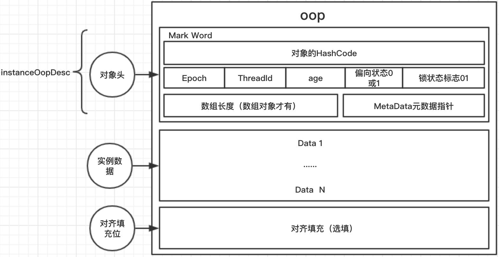

共享：资源可以由多个线程同时访问

可变：资源可以在其生命周期内被修改

锁使得多线程访问临界资源，有序访问修改共享可变状态的访问

加锁目的：序列化访问临界资源，实现多线程的同步互斥访问

显示锁：需要自己写代码进行加锁和解锁

隐式锁：不需要写代码进行解锁和加锁

方法块是通过

moniterenter 

Moniterexit

实现加锁的。moniter是一个对象监视器

在方法上，是通过

Acc_synchronied 实现加锁的

## 使用方式

1同步实例方法，锁事当前实例对象（this）

2同步类方法，锁是当前类对象（Class 对象）

3同步代码块，锁是括号里的对象

synchronied是jvm内置锁，通过内部对象的monitor（监视器对象）实现，依赖底层操作系统的mutex_lock(互斥)实现

## 对象的内存结构

对象头：有hash码，对象所属的年代，对象锁，锁状态标示，偏向锁（线程）id,偏向时间，数组长度（数组对象）等

对象实际数据：创建对象时，对象中的成员变量，方法等

对象的内存存储：对象的实例在堆区，对象的元数据在元空间（1.8以前的方法区），对象的引用在栈上

重量级锁：会涉及线程的上下文切换，涉及操作系统用户态到内核态的转换，比较消耗系统资源

jdk1.6及之后版本对synchronized做了各种优化，如适应性自旋、锁消除、锁粗化、轻量级锁和偏向锁。

Jdk1.6及之后版本默认时开启轻量级锁的

开启轻量级锁：

​	-XX:+UseBiasedLocking  使用偏向锁

​	-XX:BiasedLockingStartupDelay=0 虚拟机启动则启用偏向锁，延迟位0

关闭轻量级锁：

​	-XX:-UseBiasedLocking。不使用偏向锁

无锁 不锁任何资源，多线程只有一个线程能修改资源成功，其它线程会重试

| 偏向锁   | 只有一个线程进入临界区，适用于只有一个线程访问同步代码块的场景 |
| -------- | ------------------------------------------------------------ |
| 轻量级锁 | 多线程未竞争或竞争不激烈，适用于追求相应时间，同步执行速度非常快 |
| 重量级锁 | 多线程竞争，适用于追求吞吐量同步块执行速度较长               |

Mark work在32位中jvm的存储

对齐填充位是因为对象有固定大小，如果不够，则进行0填充

