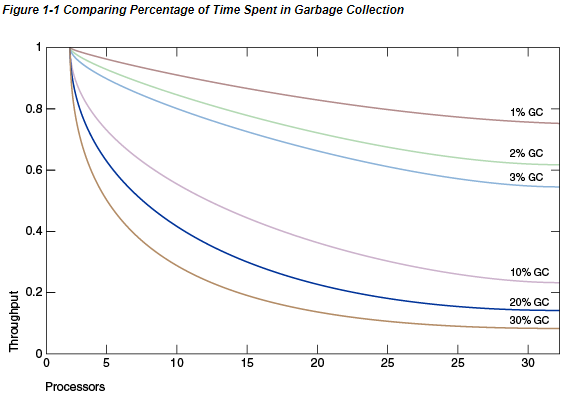
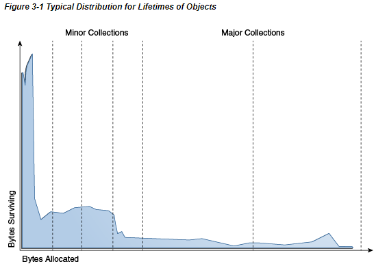
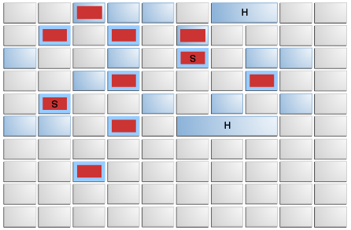

# Java平台标准版HotSpot虚拟机垃圾收集调优指南


## 1介绍

从台式机上的小程序到大型服务器上的Web服务，各种各样的应用程序都使用Java平台标准版（Java SE）。为了支持这种多样化的部署范围，Java HotSpot虚拟机实现（Java HotSpot VM）提供了多个垃圾收集器，每个垃圾收集器旨在满足不同的需求。这是满足大型和小型应用程序需求的重要部分。Java SE根据运行应用程序的计算机的类别选择最合适的垃圾收集器。但是，此选择可能并非对每个应用程序都是最佳的。具有严格性能目标或其他要求的用户，开发人员和管理员可能需要明确选择垃圾回收器并调整某些参数以实现所需的性能水平。本文档提供了有助于完成这些任务的信息。首先，在串行世界级收集器的上下文中描述了垃圾收集器的一般功能和基本调整选项。然后介绍其他收集器的特定功能以及选择收集器时要考虑的因素。

垃圾收集器（GC）是一种内存管理工具。它通过以下操作实现自动内存管理：

- 将对象分配给年轻一代，并将老化的对象提升为老一代。
- 通过并发（并行）标记阶段查找旧一代中的活动对象。当Java堆总占用量超过默认阈值时，Java HotSpot VM会触发标记阶段。请参阅并发标记扫描（CMS）收集器和垃圾优先的垃圾收集器部分。
- 通过并行复制压缩活动对象来恢复可用内存。请参阅“并行收集器和垃圾优先的垃圾收集器”部分

什么时候选择垃圾收集器很重要？对于某些应用，答案永远是不可能的。也就是说，在存在垃圾收集的情况下，应用程序可以在频率和持续时间适度的暂停下表现良好。但是，对于大类应用程序却不是这种情况，特别是那些具有大量数据（多个千兆字节），许多线程和高事务处理率的应用程序。

阿姆达尔定律（给定问题中的并行加速受问题的顺序部分限制）意味着大多数工作负载无法完美并行化；某些部分始终是顺序的，不能从并行性中受益。Java平台也是如此。特别是，Java SE 1.4之前的Oracle针对Java平台的虚拟机不支持并行垃圾收集，因此，垃圾收集在多处理器系统上的影响相对于其他并行应用程序会增加。

图1-1“比较垃圾收集中所用时间的百分比”中的图形对理想系统进行了建模，该系统除了垃圾收集（GC）之外，还具有完美的可伸缩性。红线表示应用程序仅在单处理器系统上花费1％的时间进行垃圾回收。在具有32个处理器的系统上，这意味着吞吐量损失超过20％。洋红线显示，对于一个应用程序来说，垃圾回收有10％的时间（在单处理器应用程序中，垃圾回收的时间不算多），当扩展到32个处理器时，会损失超过75％的吞吐量。



“图1-1比较垃圾收集中所花费的时间百分比”的描述

这表明，在小型系统上进行开发时，可以忽略的速度问题可能会在扩展到大型系统时成为主要瓶颈。但是，在减少这种瓶颈方面进行小的改进可以提高性能。对于足够大的系统，有必要选择正确的垃圾收集器并在必要时进行调整。

串行收集器通常适合大多数“小型”应用程序（那些需要高达100兆字节（在现代处理器上为MB）的堆。其他收集器具有额外的开销或复杂性，这是特殊行为的代价。不需要串行收集器的特殊行为，请使用串行收集器。一种不希望串行收集器成为最佳选择的情况是大型，线程密集的应用程序，该应用程序在具有大量内存和两个内存的计算机上运行当在此类服务器级计算机上运行应用程序时，默认情况下会选择并行收集器，请参见“人体工程学”部分。

本文档是使用Solaris操作系统（SPARC Platform Edition）上的Java SE 8作为参考而开发的。但是，此处介绍的概念和建议适用于所有受支持的平台，包括Linux，Microsoft Windows，Solaris操作系统（x64平台版）和OSX。此外，尽管所有支持的平台都提供了提到的命令行选项。每个平台上某些选项的默认值可能不同。

## 2人机工程学

初始堆大小为1/64的物理内存，最大为1 GB

### 基于行为的调整

对于并行收集器，Java SE提供了两个垃圾收集调整参数，这些参数基于实现应用程序的指定行为：最大暂停时间目标和应用程序吞吐量目标；以及请参阅“并行收集器”部分。（这两个选项在其他收集器中不可用。）请注意，这些行为不能始终得到满足。该应用程序需要一个足够大的堆，以至少容纳所有实时数据。此外，最小堆大小可能会阻止达到这些期望的目标。

#### 最大暂停时间目标

暂停时间是垃圾收集器停止应用程序并恢复不再使用的空间的持续时间。最大暂停时间目标的目的是限制这些暂停中的最长时间。垃圾回收器会保持平均的停顿时间和该平均值的方差。平均值是从执行开始时获取的，但经过加权后，最近的暂停次数会增加。如果平均时间加上暂停时间的方差大于最大暂停时间目标，则垃圾回收器认为未达到目标。

最大暂停时间目标是通过命令行选项-XX：MaxGCPauseMillis = <nnn>指定的。这被解释为向垃圾收集器的提示，要求暂停时间为<nnn>毫秒或更短。垃圾收集器将调整Java堆大小以及与垃圾收集相关的其他参数，以使垃圾收集暂停时间短于<nnn>毫秒。默认情况下，没有最大暂停时间目标。这些调整可能导致垃圾回收器更频繁地发生，从而降低了应用程序的整体吞吐量。垃圾收集器会尝试在吞吐量目标之前达到任何暂停时间目标。但是，在某些情况下，无法达到所需的暂停时间目标。

#### 吞吐量目标

吞吐量目标是根据收集垃圾所花费的时间和垃圾收集之外所花费的时间（称为应用程序时间）来衡量的。该目标由命令行选项-XX：GCTimeRatio = <nnn>指定。垃圾回收时间与应用程序时间的比率为1 /（1 + <nnn>）。例如，-XX：GCTimeRatio = 19将目标设置为垃圾收集总时间的1/20或5％。

垃圾收集所花费的时间是年轻一代和老一代收集的总时间。如果没有达到吞吐量目标，那么将增加世代的大小，以增加应用程序在集合之间运行的时间。

#### 足迹目标

如果已满足吞吐量和最大暂停时间目标，则垃圾收集器会减小堆的大小，直到无法满足其中一个目标（始终是吞吐量目标）。然后解决未实现的目标。

### 调整策略

除非您知道需要的堆大于默认的最大堆大小，否则不要为堆选择最大值。选择适合您的应用程序的吞吐量目标。

堆将增长或缩小到可以支持所选吞吐量目标的大小。应用程序行为的更改可能导致堆增大或缩小。例如，如果应用程序开始以更高的速率分配，堆将增长以保持相同的吞吐量。

如果堆增长到最大大小，并且无法满足吞吐量目标，则最大堆大小对于吞吐量目标而言太小。将最大堆大小设置为接近平台上总物理内存但不会导致应用程序交换的值。再次执行该应用程序。如果仍然没有达到吞吐量目标，那么对于平台上的可用内存来说，应用程序时间目标太高了。

通常，随着垃圾收集器试图满足竞争目标，堆的大小会振荡。即使应用程序已达到稳定状态，也是如此。达到吞吐量目标（可能需要更大的堆）的压力与目标竞争，以获得最大的暂停时间和最小的占用空间（这两者都可能需要小的堆）。

## 3Generations 分代

Java SE平台的优势之一在于，它使开发人员免受内存分配和垃圾回收的复杂性的困扰。但是，当垃圾收集是主要瓶颈时，了解此隐藏实现的某些方面很有用。垃圾收集器对应用程序使用对象的方式进行了假设，这些反映在可调整的参数中，可以调整这些参数以提高性能，而又不牺牲抽象的功能。

如果无法从正在运行的程序中的任何指针访问对象，则该对象被视为垃圾。最简单的垃圾回收算法会遍历每个可访问对象。剩下的任何对象都被视为垃圾。这种方法所花费的时间与活动对象的数量成正比，这对于维护大量活动数据的大型应用程序是不允许的。

虚拟机合并了许多不同的垃圾收集算法，这些算法使用分代收集进行组合。天真的垃圾收集检查堆中的每个活动对象，而世代收集则利用大多数应用程序的经验观察到的属性，以最大程度地减少回收未使用的（垃圾）对象所需的工作。这些观察到的特性中最重要的是弱代假设，该假设指出大多数物体只能存活很短的时间。

图3-1“对象生命周期的典型分布”中的蓝色区域是对象生命周期的典型分布。x轴是对象寿命，以分配的字节为单位。y轴上的字节数是具有相应生存期的对象中的总字节数。左侧的尖峰表示分配后可以回收的对象（换句话说，已“死亡”）。例如，迭代器对象通常在单个循环期间仍处于活动状态。



“图3-1对象生命周期的典型分布”的描述

有些对象的寿命更长，因此分布向右延伸。例如，通常有一些在初始化时分配的对象，这些对象一直存在，直到进程退出。在这两个极端之间的是在某些中间计算过程中存在的对象，在这里将其视为初始峰右边的肿块。一些应用程序的外观分布非常不同，但是令人惊讶的是，大量应用程序具有这种总体形状。通过关注大多数对象“早逝”这一事实，可以进行有效的收集。

为了针对这种情况进行优化，需要分代管理内存（保存不同年龄对象的内存池）。当世代填满时，垃圾收集会在每个世代中发生。绝大多数对象分配在专用于年轻对象（年轻一代）的池中，并且大多数对象在那里死亡。当年轻一代填满时，将导致次要集合，其中仅收集年轻一代。不回收其他世代的垃圾。假设弱的世代假设成立并且年轻一代中的大多数对象都是垃圾并且可以回收，可以优化次要集合。首先，这种收集的费用与所收集的有生命物体的数量成正比；可以很快收集到充满死亡物体的年轻一代。通常，在每个次要收藏期间，来自年轻世代的尚存对象的一部分会移交给终身代。最终，终身代将填满并且必须被收集，从而产生一个主要集合，其中将收集整个堆。主要集合的持续时间通常比次要集合的持续时间长得多，因为涉及的对象数量很多。

如“人体工程学”部分所述，人体工程学动态选择垃圾回收器，以在各种应用程序上提供良好的性能。串行垃圾收集器是为具有小型数据集的应用程序设计的，其默认参数被选择为对大多数小型应用程序有效。并行或吞吐量垃圾收集器旨在与具有中大型数据集的应用程序一起使用。通过人机工程学选择的堆大小参数以及自适应大小策略的功能旨在为服务器应用程序提供良好的性能。这些选择在大多数（但不是全部）情况下都有效，这导致了本文档的中心宗旨：

注意：如果垃圾收集成为瓶颈，您很可能必须自定义总堆大小以及各个世代的大小。检查详细的垃圾收集器输出，然后探索各个性能指标对垃圾收集器参数的敏感性。

图3-2“除并行收集器和G1之外的其他世代的默认排列”显示了世代的默认排列（对于所有收集器，并行收集器和G1除外）：

图3-2除并行收集器和G1之外的世代默认排列


“图3-2世代的默认排列，并行收集器和G1除外”的说明

在初始化时，最大的地址空间实际上是保留的，除非需要，否则不会分配给物理内存。为对象存储器保留的完整地址空间可以分为年轻一代和终身一代。

年轻一代由伊甸园和两个幸存者空间组成。大多数对象最初是在eden中分配的。一个幸存者空间随时都是空的，可作为伊甸园中任何活物的目的地；另一个幸存者空间是下一个复制集合期间的目的地。以这种方式在幸存者空间之间复制对象，直到它们足够老到可以使用（复制到使用对象的年代）为止。

### 性能考量

有两种主要的垃圾收集性能度量：

- 吞吐量是长时间内未花费在垃圾回收上的总时间的百分比。吞吐量包括分配所花费的时间（但是通常不需要调整分配速度）。
- 暂停是指由于正在进行垃圾回收而导致应用程序无响应的时间。

用户对垃圾回收有不同的要求。例如，某些人认为Web服务器的正确度量标准是吞吐量，因为垃圾收集期间的暂停可能是可以容忍的，或者可能被网络延迟所掩盖。但是，在交互式图形程序中，即使短暂的暂停也会对用户体验产生负面影响。

一些用户对其他注意事项敏感。足迹是流程的工作集，以页和缓存行为单位。在具有有限物理内存或许多进程的系统上，占用空间可能决定可伸缩性。即时性是指对象死掉和内存可用之间的时间，这是分布式系统（包括远程方法调用（RMI））的重要考虑因素。

通常，为特定世代选择大小是这些考虑之间的权衡。例如，一个非常大的年轻一代可以最大化吞吐量，但是这样做会以占用空间，及时性和暂停时间为代价。可以通过使用少量的年轻一代来最小化年轻一代的停顿，但会降低吞吐量。一代的大小不会影响另一一代的收集频率和暂停时间。

没有选择世代大小的正确方法。最佳选择取决于应用程序使用内存的方式以及用户需求。因此，虚拟机对垃圾收集器的选择并非总是最佳选择，并且可以用“调整世代大小”部分中介绍的命令行选项覆盖。

### Measurement测量 度量

使用特定于应用程序的度量标准可以最好地衡量吞吐量和占用空间。例如，可以使用客户端负载生成器来测试Web服务器的吞吐量，而可以使用pmap命令在Solaris操作系统上测量服务器的占用空间。但是，通过检查虚拟机本身的诊断输出，很容易估算出由于垃圾收集而引起的暂停。

命令行选项-verbose：gc使有关堆和垃圾收集的信息在每个收集处输出。例如，以下是大型服务器应用程序的输出：

```
[GC 325407K->83000K(776768K), 0.2300771 secs] 
[GC 325816K->83372K(776768K), 0.2454258 secs]
[Full GC 267628K->83769K(776768K), 1.8479984 secs]
```

输出显示两个次要集合，然后是一个主要集合。箭头之前和之后的数字（例如，第一行的325407K-> 83000K）分别表示垃圾回收之前和之后的活动对象的组合大小。在进行次要收集之后，该大小包括一些垃圾（不再存在）但无法回收的对象。这些对象包含在使用期限的代中或从使用期限的代中引用。

括号中的下一个数字（例如，从第一行起再次为（776768K））是堆的已提交大小：可用于Java对象而不需要从操作系统请求更多内存的空间量。请注意，此数字仅包括幸存者空间之一。除了在垃圾回收期间，在任何给定时间仅将使用一个幸存空间来存储对象。

该行的最后一项（例如0.2300771秒）指示执行收集所需的时间，在这种情况下约为四分之一秒。

第三行中主要收藏的格式相似。

注意：-verbose：gc产生的输出格式可能会在将来的版本中更改。

命令行选项-XX：+ PrintGCDetails导致要打印的有关集合的其他信息。此处显示了使用串行垃圾收集器的-XX：+ PrintGCDetails输出示例。

```
[GC [DefNew: 64575K->959K(64576K), 0.0457646 secs] 196016K->133633K(261184K), 0.0459067 secs]
```

这表明次要收集回收了约98％的年轻代，DefNew：64575K-> 959K（64576K），并花费了0.0457646秒（约45毫秒）。

整个堆的使用率减少到约51％（196016K-> 133633K（261184K）），并且收集的最后时间（年轻一代的收集之上和之上）有一些额外的开销。0.0459067秒

注意：-XX：+ PrintGCDetails产生的输出格式可能会在将来的版本中更改。

选项-XX：+ PrintGCTimeStamps在每个集合的开始处添加一个时间戳。这对于查看垃圾收集发生的频率很有用。

```
111.042: [GC 111.042: [DefNew: 8128K->8128K(8128K), 0.0000505 secs]111.042: [Tenured: 18154K->2311K(24576K), 0.1290354 secs] 26282K->2311K(32704K), 0.1293306 secs]
```

收集开始到应用程序执行大约111秒。次要收集大约在同一时间开始。此外，还显示了Tenured所描绘的主要收藏的信息。终身使用率降低到约10％（18154K-> 2311K（24576K）），并花费了0.1290354秒（约130毫秒）。

## 4调整分代大小

许多参数会影响世代大小。图4-1“堆参数”说明了堆中已提交空间和虚拟空间之间的差异。在虚拟机初始化时，将保留堆的整个空间。可以使用-Xmx选项指定保留空间的大小。如果-Xms参数的值小于-Xmx参数的值，则并非所有保留的空间都会立即提交给虚拟机。在此图中，未使用的空间标记为“虚拟”。堆的不同部分（使用权的一代和年轻一代）可以根据需要增长到虚拟空间的极限。

一些参数是堆的一部分与另一部分的比率。例如，参数NewRatio表示保有权代与年轻代的相对大小。

图4-1堆参数


“图4-1堆参数”的说明

### 总堆

以下有关增大和缩小堆以及默认堆大小的讨论不适用于并行收集器。（有关使用并行收集器调整堆大小和默认堆大小的详细信息，请参见“调整世代大小”中的“并行收集器人机工程学”一节。）但是，控制堆总大小和世代大小的参数确实适用于并行收集器。

影响垃圾收集性能的最重要因素是总可用内存。由于收集是在世代填满时发生的，因此吞吐量与可用内存量成反比。

默认情况下，虚拟机会在每个集合上增加或缩小堆，以尝试将每个集合中活动对象的可用空间比例保持在特定范围内。该目标范围由参数-XX：MinHeapFreeRatio = <minimum>和-XX：MaxHeapFreeRatio = <maximum>设置为百分比，总大小的下限为-Xms <min>，上限为-Xmx <max>。表4-1“ 64位Solaris操作系统的默认参数”中显示了64位Solaris操作系统（SPARC平台版本）的默认参数：

表4-1 64位Solaris操作系统的默认参数

| 参数             | 默认值     |
| ---------------- | ---------- |
| MinHeapFreeRatio | 40         |
| MaxHeapFreeRatio | 70         |
| -Xms             | 6656k      |
| -Xmx             | calculated |

使用这些参数，如果某代中的可用空间百分比下降到40％以下，那么该代将被扩展以维持40％的可用空间，直到该代的最大允许大小。同样，如果可用空间超过70％，则将收缩该世代，以便只有70％的空间是空闲的，这取决于该世代的最小大小。

如表4-1“ 64位Solaris操作系统的默认参数”中所述，默认的最大堆大小是由JVM计算的值。Java SE中用于并行收集器和服务器JVM的计算现在用于所有垃圾收集器。计算的一部分是最大堆大小的上限，这对于32位平台和64位平台而言是不同的。请参阅“并行收集器”中的“默认堆大小”部分。客户端JVM的计算与此类似，这导致最大堆大小小于服务器JVM。

以下是有关服务器应用程序堆大小的一般准则：

- 除非您在暂停方面遇到问题，否则请尝试为虚拟机分配尽可能多的内存。默认大小通常太小。
- 将-Xms和-Xmx设置为相同的值可以通过从虚拟机中删除最重要的大小确定决策来提高可预测性。但是，如果选择不当，虚拟机将无法补偿。
- 通常，由于分配可以并行化，因此随着处理器数量的增加而增加内存。

### 年轻一代

在总可用内存之后，影响垃圾收集性能的第二大影响因素是专用于年轻一代的堆的比例。年轻一代越大，垃圾收集的次数就越少。但是，对于有限的堆大小，较大的年轻代意味着较小的老年代，这将增加major gc的频率。最佳选择取决于应用程序分配的对象的生命周期分布。

默认情况下，年轻代大小由参数NewRatio控制。例如，设置-XX：NewRatio = 3表示年轻一代和终身一代之间的比率为1：3。换句话说，伊甸园空间和幸存者空间的总大小将是堆总大小的四分之一。

参数NewSize和MaxNewSize从下方和上方限制了年轻代的大小。将它们设置为相同的值可以修复年轻一代，就像将-Xms和-Xmx设置为相同的值可以修复总堆大小一样。这对于以比NewRatio允许的整数倍更好的粒度调整年轻代很有用。

#### 幸存者空间大小

您可以使用参数SurvivorRatio来调整幸存空间的大小，但这对性能通常并不重要。例如，-XX：SurvivorRatio = 6将伊甸园和幸存空间之间的比率设置为1：6。换句话说，每个幸存者空间将是伊甸园大小的六分之一，因此是年轻一代的八分之一（而不是七分之一，因为有两个幸存者空间）。】、

如果幸存者空间太小，则复制集合将直接溢出到老年代。如果幸存者空间太大，它们将毫无用处。在每次垃圾回收时，虚拟机都会选择一个阈值数字，该阈值是对象在使用期限之前可以复制的次数。选择此阈值可使幸存者半满。命令行选项-XX：+ PrintTenuringDistribution（并非在所有垃圾收集器上都可用）可用于显示此阈值和新一代对象的寿命。这对于观察应用程序的生命周期分布也很有用。

表4-2“幸存者空间大小调整的默认参数值”提供了64位Solaris的默认值：

表4-2幸存者空间大小调整的默认参数值

| 参数          | 默认值      |
| ------------- | ----------- |
| NewRatio      | 2           |
| NewSize       | 1310M       |
| MaxNewSize    | not limited |
| SurvivorRatio | 8           |

根据总堆的最大大小和NewRatio参数的值来计算年轻代的最大大小。MaxNewSize参数的“不受限制”默认值表示，除非在命令行上指定了MaxNewSize的值，否则计算值不受MaxNewSize的限制。

以下是服务器应用程序的一般准则：

- 首先确定您可以负担得起的虚拟机的最大堆大小。然后针对年轻一代绘制性能指标，以找到最佳设置。
  - 请注意，最大堆大小应始终小于计算机上安装的内存量，以避免过多的页面错误和崩溃。
- 如果总堆大小是固定的，则增加年轻代的大小需要减少保有代数的大小。使使用期限的代足够大，以容纳应用程序在任何给定时间使用的所有实时数据，以及一定数量的备用空间（10％到20％或更多）。
- 遵循先前对终身代的约束：
  - 给年轻一代留下很多记忆。
  - 随着处理器数量的增加，可以增加年轻代的大小，因为分配可以并行化。

## 5可用的收集器

到目前为止，讨论的是串行收集器。Java HotSpot VM包括三种不同类型的收集器，每种收集器具有不同的性能特征。

- 串行收集器使用单个线程来执行所有垃圾收集工作，这使之相对高效，因为线程之间没有通信开销。它最适合单处理器计算机，因为它不能利用多处理器硬件，尽管它在多处理器上对数据集较小（大约100 MB）的应用很有用。默认情况下，在某些硬件和操作系统配置上选择了串行收集器，或者可以通过选项-XX：+ UseSerialGC显式启用它。
- 并行收集器（也称为吞吐量收集器）并行执行次要收集，这可以大大减少垃圾收集的开销。它适用于具有在多处理器或多线程硬件上运行的中型到大型数据集的应用程序。并行收集器默认在某些硬件和操作系统配置上处于选中状态，或者可以通过选项-XX：+ UseParallelGC显式启用。
  - 并行压缩是使并行收集器能够并行执行主要收集的功能。如果没有并行压缩，则使用单个线程执行主要集合，这会大大限制可伸缩性。如果已指定选项-XX：+ UseParallelGC，则默认情况下启用并行压缩。将其关闭的选项是-XX：-UseParallelOldGC。
- 大多数并发的收集器会同时执行其大部分工作（例如，在应用程序仍在运行时），以使垃圾收集暂停时间较短。它设计用于具有中型到大型数据集的应用程序，在这些应用程序中，响应时间比整体吞吐量更重要，因为用于最小化暂停的技术会降低应用程序性能。Java HotSpot VM提供了两个主要是并发收集器之间的选择。请参阅大多数同时收集器。使用选项-XX：+ UseConcMarkSweepGC启用CMS收集器，或使用-XX：+ UseG1GC启用G1收集器。

### 选择收集器

除非您的应用程序有非常严格的暂停时间要求，否则请先运行您的应用程序并允许VM选择收集器。如有必要，请调整堆大小以提高性能。如果性能仍然不能达到您的目标，请使用以下准则作为选择收集器的起点。

- 如果应用程序的数据集较小（最大约100 MB），则选择带有选项-XX：+ UseSerialGC的串行收集器。
- 如果应用程序将在单个处理器上运行，并且没有暂停时间要求，则让VM选择收集器，或通过选项-XX：+ UseSerialGC选择串行收集器。
- 如果（a）峰值应用程序性能是第一要务，并且（b）没有暂停时间要求或暂停时间不超过1秒，则让VM选择收集器，或使用-XX：+ UseParallelGC选择并行收集器。
- 如果响应时间比整体吞吐量更重要，并且垃圾收集暂停时间必须保持小于1秒，那么请使用-XX：+ UseConcMarkSweepGC或-XX：+ UseG1GC选择并发收集器。

这些准则仅为选择收集器提供了一个起点，因为性能取决于堆的大小，应用程序维护的实时数据量以及可用处理器的数量和速度。暂停时间对这些因素特别敏感，因此前面提到的1秒阈值仅是近似值：在许多数据大小和硬件组合上，并行收集器的暂停时间将超过1秒。相反，在某些组合上，并发收集器可能无法将暂停时间保持在1秒以内。

如果推荐的收集器没有达到期望的性能，请首先尝试调整堆和世代大小以满足期望的目标。如果性能仍然不足，请尝试使用其他收集器：使用并发收集器减少暂停时间，并使用并行收集器增加多处理器硬件上的总体吞吐量。

## 6The Parallel Collector并行收集器

并行收集器（在此也称为吞吐量收集器）是类似于串行收集器的分代收集器。主要区别在于使用多个线程来加速垃圾回收。并行收集器通过命令行选项-XX：+ UseParallelGC启用。默认情况下，使用此选项，次要和主要收集都可以并行执行，以进一步减少垃圾收集的开销。

在具有N个大于8的N个硬件线程的机器上，并行收集器使用N的固定部分作为垃圾收集器线程的数量。对于较大的N值，分数约为5/8。在N的值小于8时，使用的数字为N。在选定的平台上，分数下降为5/16。垃圾回收器线程的特定数量可以使用命令行选项进行调整（稍后说明）。在具有一个处理器的主机上，由于并行执行（例如，同步）所需的开销，并行收集器的性能可能不如串行收集器。但是，当运行具有中型到大型堆的应用程序时，在具有两个处理器的机器上，它通常比串行收集器的性能要适度，并且通常在两个以上处理器可用时的性能要明显好于串行收集器。

垃圾回收器线程的数量可以通过命令行选项-XX：ParallelGCThreads = <N>来控制。如果使用命令行选项对堆进行显式调整，则并行收集器要获得良好性能所需的堆大小与串行收集器所需的堆大小相同。但是，启用并行收集器应缩短收集暂停时间。由于多个垃圾收集器线程正在参与次要收集，因此由于收集期间从年轻一代到终身代的晋升，可能会产生一些碎片。次要收集中涉及的每个垃圾收集线程都保留了使用权的一代中的一部分以进行提升，并且将可用空间划分为这些“提升缓冲区”会导致碎片效应。减少垃圾收集器线程的数量并增加使用期限的代大小将减少这种碎片效应。

### 分代

如前所述，并行收集器中的世代排列是不同的。图6-1“并行收集器中的世代布置”中显示了该布置：

图6-1并行收集器中的世代排列


“图6-1并行收集器中的世代排列”的描述

### 并行收集器人体工程学

默认情况下，在服务器级计算机上选择并行收集器。另外，并行收集器使用一种自动调整的方法，该方法允许您指定特定的行为，而不是生成大小和其他低级调整详细信息。您可以指定最大垃圾收集暂停时间，吞吐量和占用空间（堆大小）。

- 最大垃圾回收暂停时间：最大暂停时间目标是通过命令行选项-XX：MaxGCPauseMillis = <N>指定的。这被解释为需要<N>毫秒或更短的暂停时间的提示；默认情况下，没有最大暂停时间目标。如果指定了暂停时间目标，则会调整堆大小和与垃圾回收相关的其他参数，以使垃圾回收的暂停时间短于指定值。这些调整可能导致垃圾收集器降低应用程序的整体吞吐量，并且无法始终满足所需的暂停时间目标。

- 吞吐量：吞吐量目标是根据进行垃圾收集所花费的时间与在垃圾收集之外所花费的时间（称为应用程序时间）来衡量的。该目标由命令行选项-XX：GCTimeRatio = <N>指定，该选项将垃圾回收时间与应用程序时间的比率设置为1 /（1 + <N>）。

  例如，-XX：GCTimeRatio = 19将垃圾收集目标的目标设置为总时间的1/20或5％。默认值为99，导致垃圾回收的目标时间为1％。

- 占用空间：使用选项-Xmx <N>指定最大堆占用空间。另外，收集器还有一个隐含的目标，即只要满足其他目标，就将堆的大小最小化。

#### 目标优先

按照以下顺序解决目标：】

1. 最大暂停时间目标
2. 吞吐量目标
3. 最小足迹目标

首先达到最大暂停时间目标。仅在达到目标后，才能解决吞吐量目标。同样，只有在达到前两个目标后，才会考虑足迹目标。

#### 分代大小调整

收集器保留的统计信息（例如平均暂停时间）在每个收集结束时更新。然后进行确定目标是否达到的测试，并对世代大小进行任何必要的调整。唯一的例外是，在保留统计信息和调整世代大小方面，将忽略显式垃圾回收（例如，对System.gc（）的调用）。

增长和缩小世代的大小是通过增加作为世代大小的固定百分比的增量来完成的，以便使世代朝其期望的大小递增或递减。生长和收缩以不同的速率进行。默认情况下，世代以20％的增量增长，而以5％的增量缩减。增长百分比由命令行选项-XX：YoungGenerationSizeIncrement = <Y>（对于年轻一代）和-XX：TenuredGenerationSizeIncrement = <T>（对于永久代）控制。通过命令行标志-XX：AdaptiveSizeDecrementScaleFactor = <D>可以调整代收缩的百分比。如果增长增量为X％，则收缩的增量为X / D％。

如果收集器决定在启动时增加一代，则将增加一个附加百分比。该补充剂随收集物的数量而衰减，并且没有长期影响。补充的目的是提高启动性能。缩小百分比没有补充。

如果没有达到最大暂停时间目标，则一次仅缩小一代的大小。如果两个世代的暂停时间都超过了目标，则首先缩减具有较大暂停时间的世代的大小。

如果未达到吞吐量目标，则两代产品的大小都会增加。每一个都按其对总垃圾收集时间的贡献成比例增加。例如，如果年轻一代的垃圾收集时间是总收集时间的25％，并且如果年轻一代的完全增量将增加20％，则年轻一代将增加5％。

#### 默认堆大小

除非在命令行上指定了初始堆大小和最大堆大小，否则它们将根据计算机上的内存量进行计算。

#### 客户端JVM默认初始和最大堆大小

默认的最大堆大小是物理内存的一半，最大物理内存大小为192兆字节（MB），否则为四分之一的物理内存，最大物理内存大小为1 GB。

例如，如果您的计算机具有128 MB的物理内存，则最大堆大小为64 MB，并且大于或等于1 GB的物理内存将导致最大堆大小为256 MB。

除非您的程序创建了足够多的对象来要求它，否则JVM实际上并没有使用最大堆大小。在JVM初始化期间分配了一个较小的值，称为初始堆大小。此数量至少为8 MB，否则为物理内存的1/64，最大为1 GB。

分配给年轻代的最大空间量是堆总大小的三分之一。

#### 服务器JVM默认的初始和最大堆大小

默认的初始堆大小和最大堆大小在服务器JVM上的工作方式与在客户端JVM上的工作方式类似，不同之处在于，默认值可以更高。在32位JVM上，如果有4 GB或更多的物理内存，则默认的最大堆大小最多可以为1 GB。在64位JVM上，如果有128 GB或更多的物理内存，则默认的最大堆大小最大为32 GB。您始终可以通过直接指定这些值来设置更高或更低的初始堆和最大堆；见下一节

#### 指定初始和最大堆大小

您可以使用标志-Xms（初始堆大小）和-Xmx（最大堆大小）来指定初始堆大小和最大堆大小。如果知道应用程序需要多少堆才能正常工作，可以将-Xms和-Xmx设置为相同的值。否则，JVM将使用初始堆大小开始，然后将增大Java堆，直到找到堆使用和性能之间的平衡为止。

其他参数和选项可能会影响这些默认值。要验证默认值，请使用-XX：+ PrintFlagsFinal选项，然后在输出中查找MaxHeapSize。例如，在Linux或Solaris上，可以运行以下命令：

```
java -XX:+PrintFlagsFinal  -version | grep MaxHeapSize
```

### 过多的GC时间和OutOfMemoryError

如果在垃圾回收（GC）上花费了太多时间，则并行收集器将引发OutOfMemoryError：如果在垃圾回收中花费了总时间的98％以上，并且回收的堆少于2％，则抛出OutOfMemoryError。此功能旨在防止应用程序长时间运行，而由于堆太小而几乎没有进展，甚至没有进展。如有必要，可以通过在命令行中添加选项-XX：-UseGCOverheadLimit来禁用此功能。

### Measurements测量 度量

并行收集器输出的详细垃圾收集器与串行收集器的输出基本相同。

## 7多数并发收集者

Java Hotspot VM在JDK 8中有两个主要的并发收集器：

- 并发标记扫描（CMS）收集器：此收集器用于那些希望较短的垃圾收集暂停并能够与垃圾收集共享处理器资源的应用程序。
- 垃圾优先的垃圾收集器：此服务器样式的收集器用于具有大内存的多处理器计算机。它极有可能满足垃圾收集暂停时间目标，同时实现高吞吐量。

### 并发开销

大多数并发的收集器会交换处理器资源（否则该资源将可供应用程序使用）以缩短主收集的暂停时间。最明显的开销是在收集的并发部分使用一个或多个处理器。在N个处理器系统上，集合的并发部分将使用可用处理器的K / N，其中1 <= K <= ceiling {N / 4}。（请注意，对K的精确选择和限制可能会发生变化。）除了在并发阶段使用处理器之外，还会产生额外的开销来实现并发。因此，虽然并发收集器的垃圾收集暂停通常要短得多，但应用程序吞吐量也往往比其他收集器要低一些。

在具有多个处理核心的机器上，处理器在收集的并发部分可用于应用程序线程，因此并发垃圾收集器线程不会“暂停”应用程序。这通常会导致更短的暂停，但是再次有较少的处理器资源可用于应用程序，并且应该会出现一定的速度下降，尤其是在应用程序最大程度地使用所有处理核心的情况下。随着N的增加，由于并发垃圾收集而导致的处理器资源减少将变得更小，并且并发收集的收益也会增加。并发标记扫描（CMS）收集器中的并发模式故障部分讨论了此类缩放的潜在限制。

因为在并发阶段使用至少一个处理器进行垃圾回收，所以并发收集器通常不会在单处理器（单核）计算机上提供任何好处。但是，有一种适用于CMS的单独模式（非G1）可以在只有一个或两个处理器的系统上实现低暂停。有关详细信息，请参见并发标记扫描（CMS）收集器中的增量模式。Java SE 8中不推荐使用此功能，以后的主要版本中可能会删除该功能。

### 其他参考

垃圾优先收集器：

http://www.oracle.com/technetwork/java/javase/tech/g1-intro-jsp-135488.html

垃圾优先垃圾收集器优化：

http://www.oracle.com/technetwork/articles/java/g1gc-1984535.html

## 8并发标记扫描（CMS）收集器

并发标记扫描（CMS）收集器是为那些希望更短的垃圾收集暂停并且可以在应用程序运行时与垃圾收集器共享处理器资源的应用程序而设计的。通常，具有相对较长的长期数据集（大量使用期限）并在具有两个或多个处理器的计算机上运行的应用程序往往会受益于此收集器的使用。但是，对于暂停时间要求低的任何应用程序，都应考虑使用此收集器。CMS收集器通过命令行选项-XX：+ UseConcMarkSweepGC启用。

与其他可用的收集器类似，CMS收集器是老年代的。因此，次要收集和主要收集都发生了。CMS收集器尝试通过使用单独的垃圾收集器线程在执行应用程序线程的同时并跟踪可访问对象，来减少由于主要收集而导致的暂停时间。在每个主要的收集周期中，CMS收集器会在收集开始时暂停所有应用程序线程一小段时间，然后再将其暂停到收集中间。第二个停顿往往是两个停顿中较长的一个。在两个暂停期间都使用多个线程来执行收集工作。集合的其余部分（包括大多数活动对象的跟踪和无法访问对象的清除）是由一个或多个与应用程序同时运行的垃圾收集器线程完成的。次要收集可以与正在进行的主要周期交错，并在一个类似于并行收集器的方式（特别是在次要收集期间停止了应用程序线程）。

### 并发模式故障

CMS收集器使用一个或多个垃圾收集器线程，这些垃圾收集器线程与应用程序线程同时运行，目的是在存留的世代填满之前完成其收集。如前所述，在正常操作中，CMS收集器在应用程序线程仍在运行的情况下执行其大部分跟踪和清除工作，因此应用程序线程仅会看到短暂的暂停。但是，如果CMS收集器无法在使用权产生的一代填满之前完成对无法访问的对象的回收，或者如果使用权能生成的可用空闲空间块无法满足分配要求，则将暂停应用程序，并使用所有应用程序线程均已停止。无法同时完成收集的情况称为并发模式故障，表示需要调整CMS收集器参数。如果并发收集被显式垃圾回收（System.gc（））中断，或者为提供诊断工具信息所需的垃圾收集中断了，则将报告并发模式中断。

### 过多的GC时间和OutOfMemoryError

如果在垃圾回收上花费了太多时间，则CMS收集器将抛出OutOfMemoryError：如果在垃圾回收上花费了总时间的98％以上，并且回收的堆少于2％，则抛出OutOfMemoryError。此功能旨在防止应用程序长时间运行，而由于堆太小而几乎没有进展，甚至没有进展。如有必要，可以通过在命令行中添加选项-XX：-UseGCOverheadLimit来禁用此功能。

该策略与并行收集器中的策略相同，除了执行并发收集所花费的时间不计入98％的时间限制。换句话说，只有在应用程序停止时执行的收集才计入过多的GC时间。此类收集通常是由于并发模式故障或显式收集请求（例如，对System.gc的调用）引起的。

### 浮动垃圾

与Java HotSpot VM中的所有其他收集器一样，CMS收集器是一个跟踪收集器，它至少标识堆中的所有可访问对象。在Richard Jones和Rafael D. Lins的出版物《垃圾收集：自动动态内存算法》中，它是一个增量更新收集器。因为应用程序线程和垃圾收集器线程在主收集期间同时运行，所以垃圾收集器线程跟踪的对象可能随后在收集过程结束时变得不可访问。尚未回收的此类无法访问的对象称为浮动垃圾。浮动垃圾的数量取决于并发收集周期的持续时间以及应用程序对引用更新（也称为变异）的频率。此外，由于年轻一代和终身一代是独立收集的，因此每个人都是彼此的根源。作为粗略的指导，请尝试将永久代的大小增加20％，以解决浮动垃圾的问题。在一个并发收集周期结束时，将在下一个收集周期中收集堆中的浮动垃圾。

### 暂停

CMS收集器在并发收集周期中两次暂停应用程序。第一个暂停是将可从根直接访问的对象（例如，来自应用程序线程堆栈和寄存器的对象引用，静态对象等）和从堆中其他位置（例如，年轻一代）直接标记为活动对象。该第一暂停被称为初始标记暂停。第二次暂停是在并发跟踪阶段结束时进行的，它查找在CMS收集器完成对对象的跟踪之后，由于对象中引用的应用程序线程进行更新而导致并发跟踪遗漏的对象。该第二暂停称为备注暂停。

### 并发阶段

可达对象图的并发跟踪发生在初始标记暂停和注释暂停之间。在此并发跟踪阶段，一个或多个并发垃圾收集器线程可能正在使用处理器资源，否则这些资源将可供应用程序使用。结果，即使没有暂停应用程序线程，在此阶段和其他并发阶段中，受计算绑定的应用程序的应用程序吞吐量也可能会相应下降。备注暂停后，并发清除阶段将收集标识为不可访问的对象。收集周期完成后，CMS收集器将等待，几乎不消耗任何计算资源，直到下一个主要收集周期开始。

### 开始并发收集周期

使用串行收集器时，只要保有期限的代满，并且在完成收集过程中所有应用程序线程都停止时，就会发生主要收集。相反，并发收集的开始必须定时，以使收集可以在终身代变满之前完成。否则，由于并发模式故障，应用程序将观察到更长的暂停。有几种启动并发收集的方法。

根据最近的历史记录，CMS收集器将保留对权属生成耗尽之前的剩余时间以及并发收集周期所需时间的估计。使用这些动态估计，开始并发的收集周期，目的是在使用权产生之前用完收集周期。为了安全起见，对这些估计值进行了填充，因为并发模式故障的代价可能很高。

如果使用年限的一代的占用量超过初始使用量（占使用年限的百分比），则并发收集也将开始。此初始占用阈值的默认值约为92％，但是该值可能会因版本而异。可以使用命令行选项-XX：CMSInitiatingOccupancyFraction = <N>手动调整此值，其中<N>是占位的世代大小的整数百分比（0到100）。

### 安排暂停

年轻一代收藏和终身一代收藏的暂停独立发生。它们不会重叠，但是可能会快速连续发生，因此一个集合的暂停，紧接着是另一个集合的暂停，可能看起来像是一个较长的暂停。为避免这种情况，CMS收集器尝试在上一个和下一个年轻暂停之间的大致中间时间安排注释暂停。当前未针对初始标记暂停执行此计划，该时间通常比标记暂停短得多。

### 增量模式

请注意，在Java SE 8中不赞成使用增量模式，在将来的主要版本中可能会删除它。

CMS收集器可以在并发阶段以增量方式完成的模式下使用。回想一下，在并发阶段，垃圾收集器线程正在使用一个或多个处理器。增量模式旨在通过定期停止并发阶段以使处理器退还给应用程序来减轻长时间并发阶段的影响。这种模式在这里称为i-cms，它将收集器同时完成的工作划分为年轻一代收集之间安排的一小段时间。当需要CMS收集器提供的低暂停时间的应用程序在具有少量处理器（例如1或2）的计算机上运行时，此功能很有用。

并发收集周期通常包括以下步骤：

- 停止所有应用程序线程，从根目录确定可访问的对象集，然后继续所有应用程序线程。
- 在应用程序线程正在执行时，使用一个或多个处理器同时跟踪可访问对象图。
- 同时使用一个处理器回溯自上一步中的跟踪以来修改的对象图的各个部分。
- 停止所有应用程序线程，并追溯自上次检查以来可能已被修改的根和对象图中的部分，然后恢复所有应用程序线程。
- 同时使用一个处理器将无法访问的对象清除到用于分配的空闲列表中。
- 同时使用一个处理器调整堆的大小并为下一个收集周期准备支持数据结构。

通常，CMS收集器在整个并发跟踪阶段使用一个或多个处理器，而不会自愿放弃它们。同样，一个处理器用于整个并发扫描阶段，而不会放弃它。对于具有响应时间限制的应用程序（否则可能已经使用处理核心）的应用程序，这种开销可能会造成很大的破坏，尤其是在仅具有一个或两个处理器的系统上运行时。增量模式通过将并发阶段分解为短暂的活动突发来解决此问题，这些活动计划在较小的暂停之间进行。

i-cms模式使用占空比来控制CMS收集器在自愿放弃处理器之前可以执行的工作量。占空比是允许CMS收集器运行的年轻收集之间的时间百分比。i-cms模式可以根据应用程序的行为自动计算占空比（推荐的方法，称为自动起搏），也可以在命令行上将占空比设置为固定值。

#### 命令行选项

表8-1“ i-cms的命令行选项”列出了控制i-cms模式的命令行选项。“推荐的选项”部分建议了一组初始选项。

表8-1 i-cms的命令行选项

| 选项                            | 描述                                                         | Default Value, Java SE 5 and Earlier | Default Value, Java SE 6 and Later |
| ------------------------------- | ------------------------------------------------------------ | ------------------------------------ | ---------------------------------- |
| -XX:+CMSIncrementalMode         | 启用增量模式。请注意，也必须启用CMS收集器（使用-XX：+ UseConcMarkSweepGC），此选项才能起作用。 | disabled                             | disabled                           |
| -XX:+CMSIncrementalPacing       | 启用自动定步。增量模式占空比根据JVM运行时收集的统计信息自动调整。 | disabled                             | disabled                           |
| -XX:CMSIncrementalDutyCycle=    | 允许CMS收集器运行次要收集之间的时间百分比（0到100）。如果启用了CMSIncrementalPacing，则这只是初始值。 | 50                                   | 10                                 |
| -XX:CMSIncrementalDutyCycleMin= | 启用CMSIncrementalPacing时占空因数下限的百分比（0到100）。   | 10                                   | 0                                  |
| -XX:CMSIncrementalSafetyFactor= | 计算占空比时用于增加保守性的百分比（0到100）                 | 10                                   | 10                                 |
| -XX:CMSIncrementalOffset=       | 在次要收集之间的时间段内，增量模式占空比向右移动的百分比（0到100）。 | 0                                    | 0                                  |
| -XX:CMSExpAvgFactor=            | 计算CMS收集统计信息的指数平均值时，用于加权当前样本的百分比（0到100）。 | 25                                   | 25                                 |

#### 推荐选项

要在Java SE 8中使用i-cms，请使用以下命令行选项：

```
-XX:+UseConcMarkSweepGC -XX:+CMSIncrementalMode \ -XX:+PrintGCDetails -XX:+PrintGCTimeStamps
```

前两个选项分别启用CMS收集器和i-cms。不需要最后两个选项。它们只是使有关垃圾收集的诊断信息写入标准输出，因此可以看到垃圾收集行为并在以后进行分析。

对于Java SE 5和更早版本，Oracle建议使用以下内容作为i-cms的初始命令行选项集：

```
-XX:+UseConcMarkSweepGC -XX:+CMSIncrementalMode \ -XX:+PrintGCDetails -XX:+PrintGCTimeStamps \ -XX:+CMSIncrementalPacing -XX:CMSIncrementalDutyCycleMin=0 -XX:CMSIncrementalDutyCycle=10
```

对于JavaSE8，建议使用相同的值，尽管控制i-cms自动起搏的三个选项的值已成为JavaSE6的默认值。

#### 基本故障排除

i-cms自动调整功能使用程序运行时收集的统计信息来计算占空比，以便并发收集在堆变满之前完成。但是，过去的行为并不是未来行为的完美预测，并且估计值可能并不总是足够准确以防止堆变满。如果出现了太多的完整集合，请尝试一次在表8-2“对i-cms自动起步功能进行故障排除”中的步骤。

表8-2对i-cms自动起步功能进行故障排除

| Step                                 | Options                                                    |
| ------------------------------------ | ---------------------------------------------------------- |
| 1.增加安全系数。                     | `-XX:CMSIncrementalSafetyFactor=```                        |
| 2.增加最小占空比。                   | `-XX:CMSIncrementalDutyCycleMin=```                        |
| 3.禁用自动起搏，并使用固定的占空比。 | `-XX:-CMSIncrementalPacing -XX:CMSIncrementalDutyCycle=``` |

### Measurements测量度量

例8-1“ CMS收集器的输出”是CMS收集器的输出，带有选项-verbose：gc和-XX：+ PrintGCDetails，其中删除了一些次要细节。请注意，CMS收集器的输出散布在次要收集的输出中。通常在并发收集周期中会发生许多次要收集。CMS-initial-mark指示并发收集周期的开始，CMS-concurrent-mark指示并发标记阶段的结束，并且CMS-concurrent-sweep指示并发清除阶段的结束。CMS-concurrent-preclean表示预清洁阶段，以前没有讨论过。预清洁代表可以在准备备注阶段CMS-mark的同时执行的工作。最终阶段由CMS-concurrent-reset指示，并且正在准备下一个并发收集。

示例8-1 CMS收集器的输出

```
[GC [1 CMS-initial-mark: 13991K(20288K)] 14103K(22400K), 0.0023781 secs]
[GC [DefNew: 2112K->64K(2112K), 0.0837052 secs] 16103K->15476K(22400K), 0.0838519 secs]
...
[GC [DefNew: 2077K->63K(2112K), 0.0126205 secs] 17552K->15855K(22400K), 0.0127482 secs]
[CMS-concurrent-mark: 0.267/0.374 secs]
[GC [DefNew: 2111K->64K(2112K), 0.0190851 secs] 17903K->16154K(22400K), 0.0191903 secs]
[CMS-concurrent-preclean: 0.044/0.064 secs]
[GC [1 CMS-remark: 16090K(20288K)] 17242K(22400K), 0.0210460 secs]
[GC [DefNew: 2112K->63K(2112K), 0.0716116 secs] 18177K->17382K(22400K), 0.0718204 secs]
[GC [DefNew: 2111K->63K(2112K), 0.0830392 secs] 19363K->18757K(22400K), 0.0832943 secs]
...
[GC [DefNew: 2111K->0K(2112K), 0.0035190 secs] 17527K->15479K(22400K), 0.0036052 secs]
[CMS-concurrent-sweep: 0.291/0.662 secs]
[GC [DefNew: 2048K->0K(2112K), 0.0013347 secs] 17527K->15479K(27912K), 0.0014231 secs]
[CMS-concurrent-reset: 0.016/0.016 secs]
[GC [DefNew: 2048K->1K(2112K), 0.0013936 secs] 17527K->15479K(27912K), 0.0014814 secs
]
```

相对于次要收集暂停时间，初始标记暂停通常较短。并发阶段（并发标记，并发预清理和并发扫描）通常持续的时间明显长于次要收集暂停，如示例8-1“ CMS收集器的输出”所示。但是请注意，在这些并发阶段中不会暂停应用程序。备注停顿的长度通常可与次要收藏相媲美。备注暂停受某些应用程序特性的影响（例如，对象修改率较高，可能会增加此暂停）以及自上次次要收集以来的时间（例如，年轻一代中的更多对象可能会增加此暂停）。

## 9 Garbage-First Garbage Collector

Garbage-First（G1）垃圾收集器是一种服务器样式的垃圾收集器，适用于具有大内存的多处理器计算机。它尝试以高概率满足垃圾收集（GC）暂停时间目标，同时实现高吞吐量。全堆操作（例如全局标记）与应用程序线程同时执行。这样可以防止与堆或活动数据大小成比例的中断。

G1收集器通过多种技术实现了高性能和暂停时间目标。

堆被划分为一组大小相等的堆区域，每个堆区域都有一个连续的虚拟内存范围。G1执行并发全局标记阶段，以确定整个堆中对象的活动性。标记阶段完成后，G1知道哪些区域大部分为空。它首先收集这些区域，这通常会产生大量的自由空间。这就是为什么这种垃圾收集方法称为“垃圾优先”的原因。顾名思义，G1将其收集和压缩活动集中在可能充满可回收对象（即垃圾）的堆区域。G1使用暂停预测模型满足用户定义的暂停时间目标，并根据指定的暂停时间目标选择要收集的区域数。

G1将对象从堆的一个或多个区域复制到堆上的单个区域，并在此过程中压缩并释放内存。撤离是在多处理器上并行执行的，以减少暂停时间并增加吞吐量。因此，对于每个垃圾回收，G1都会不断减少碎片。这超出了先前两种方法的能力。CMS（并发标记扫描）垃圾收集不会进行压缩。并行压缩仅执行整堆压缩，这会导致相当长的暂停时间。

重要的是要注意，G1不是实时收集器。它很有可能达到设定的暂停时间目标，但并非绝对确定。根据先前收集的数据，G1估计在目标时间内可以收集多少个区域。因此，收集器具有收集区域成本的合理准确的模型，并且收集器使用此模型来确定要收集哪些和多少区域同时停留在暂停时间目标内。

G1的首要重点是为运行需要大堆且GC延迟有限的应用程序的用户提供解决方案。这意味着堆大小约为6 GB或更大，并且稳定且可预测的暂停时间低于0.5秒。

如果应用程序具有以下一个或多个特征，那么今天运行CMS或并行压缩的应用程序将从切换到G1中受益。

- 超过50％的Java堆被实时数据占用。
- 对象分配率或提升率差异很大。
- 该应用程序正在经历不希望的长时间垃圾收集或压缩暂停（长于0.5到1秒）。

计划将G1作为并发标记扫描收集器（CMS）的长期替代产品。将G1与CMS进行比较，可以发现使G1成为更好解决方案的差异。一个区别是G1是压紧收集器。同样，G1提供的垃圾收集暂停比CMS收集器更具可预测性，并允许用户指定所需的暂停目标。

与CMS一样，G1专为需要较短GC暂停的应用而设计

G1将堆划分为固定大小的区域（灰色框），如图9-1“按G1进行堆划分”。

图9-1按G1进行堆划分



“图9-1通过G1进行堆划分”的描述

从逻辑上讲，G1是世代相传的。一组空区域被指定为逻辑年轻代。在图中，年轻一代是浅蓝色的。分配工作是从逻辑上年轻的一代中进行的，当年轻一代已满时，该区域集将被垃圾收集（一个年轻的集合）。在某些情况下，可以同时收集一组年轻区域之外的区域（深蓝色的旧区域）。这称为混合集合。在图中，正在收集的区域用红色框标记。该图说明了混合的收集，因为同时收集了年轻区域和旧区域。垃圾收集是一个压缩收集，它将活动对象复制到选定的最初为空的区域。根据幸存对象的年龄，可以将对象复制到幸存者区域（标有“ S”）或复制到旧区域（未具体显示）。标有“ H”的区域包含的绒毛物体大于一个区域的一半，并且经过特殊处理；请参阅“垃圾优先垃圾收集器”中的“垃圾对象和垃圾分配”部分。

### 分配（疏散）失败

与CMS一样，G1收集器会在应用程序继续运行时运行其部分收集，并且存在应用程序分配对象的速度快于垃圾收集器可以回收可用空间的风险。有关类似的CMS行为，请参见并发标记扫描（CMS）收集器中的并发模式故障部分。在G1中，当G1将活动数据从一个区域复制（撤离）到另一个区域时，发生故障（Java堆耗尽）。复制是为了压缩实时数据。如果在撤离正在收集垃圾的区域时找不到空闲（空）区域，则会发生分配失败（因为没有空间来从正在撤离的区域分配有生命的物体），并停止世界活动（STW）已完成完整收集。

### 浮动垃圾

对象可能在G1收集期间死亡，无法收集。G1使用一种称为快照快照（SATB）的技术来确保垃圾收集器找到所有活动对象。SATB指出，出于收集的目的，在并发标记（整个堆上的标记）开始时处于活动状态的任何对象都被视为处于活动状态。SATB以类似于CMS增量更新的方式允许浮动垃圾。

### 暂停

G1暂停应用程序以将活动对象复制到新区域。这些暂停可以是仅收集年轻区域的年轻收集暂停，也可以是疏散年轻和旧区域的混合收集暂停。与CMS一样，在应用程序停止时，有一个最终标记或备注暂停以完成标记。CMS还具有初始标记暂停，而G1则作为疏散暂停的一部分进行初始标记工作。G1在集合的结尾具有清理阶段，该阶段部分为STW，部分为并发。清理阶段的STW部分标识空区域，并确定旧区域作为下一个集合的候选对象。

### 卡表和并发阶段

如果垃圾收集器没有收集整个堆（增量收集），则垃圾收集器需要知道从堆的未收集部分到正在收集的堆部分中的指针在哪里。这通常用于分代垃圾回收器，其中堆的未收集部分通常是旧的一代，而堆的收集部分是年轻的一代。用于保存该信息的数据结构（指向年轻一代对象的老一代指针）是一个可记住的集合。牌桌是一种特殊的记忆套。Java HotSpot VM使用字节数组作为卡表。每个字节称为卡。卡与堆中的地址范围相对应。弄脏卡意味着将字节的值更改为脏值。脏值可能在卡所覆盖的地址范围内包含从旧一代到年轻一代的新指针。

处理卡意味着查看卡，看是否有老一代指向年轻一代的指针，并可能对该信息进行某些处理，例如将其传输到另一个数据结构。

G1具有并发标记阶段，该阶段标记从应用程序中找到的活动对象。并发标记从疏散暂停（完成初始标记工作）结束到标记为止。并发清理阶段将集合清空的区域添加到空闲区域列表中，并清除记住的那些区域集。另外，并发优化线程根据需要运行，以处理已被应用程序写入弄脏并且可能具有跨区域引用的卡表条目。

### 开始并发收集周期

如前所述，无论是旧区还是旧区，都是混合收集的垃圾。为了收集旧区域，G1对堆中的活动对象进行了完整的标记。这种标记是通过并发标记阶段完成的。当整个Java堆的占用达到参数InitiatingHeapOccupancyPercent的值时，将开始并发标记阶段。使用命令行选项-XX：InitiatingHeapOccupancyPercent = <NN>设置此参数的值。InitiatingHeapOccupancyPercent的默认值为45。

### 暂停时间目标

使用标志MaxGCPauseMillis为G1设置一个暂停时间目标。G1使用预测模型来决定在该目标暂停时间内可以完成多少垃圾收集工作。在收集结束时，G1选择要在下一个收集（收集集）中收集的区域。集合集将包含年轻区域（其大小的总和决定了逻辑年轻代的大小）。G1部分地通过选择集合集中的年轻区域的数量来控制GC暂停的长度。您可以与其他垃圾回收器一样，在命令行上指定年轻代的大小，但是这样做可能会妨碍G1达到目标暂停时间的能力。除了暂停时间目标之外，您还可以指定可能发生暂停的时间段的长度。您可以在此时间段（GCPauseIntervalMillis）以及暂停时间目标中指定最小的转换器使用量。MaxGCPauseMillis的默认值为200毫秒。GCPauseIntervalMillis（0）的默认值等效于时间跨度上的任何要求。

## 10 Garbage-First Garbage Collector Tuning

本节介绍如何调整和调整“垃圾优先”垃圾收集器（G1 GC）以进行评估，分析和性能。、

如“垃圾首先垃圾收集器”部分中所述，G1 GC是一个区域化的世代垃圾收集器，这意味着Java对象堆（堆）被划分为多个大小相等的区域。启动时，Java虚拟机（JVM）设置区域大小。区域大小可以从1 MB到32 MB不等，具体取决于堆大小。目标是不超过2048个区域。伊甸园，幸存者和前几代人是这些区域的逻辑集合，并不相邻。

G1 GC具有尝试达到的暂停时间目标（软实时）。在年轻系列中，G1 GC会调整其年轻一代（伊甸园和幸存者的大小），以达到实时的软目标。有关G1 GC为何暂停的原因以及如何设置暂停时间目标的信息，请参阅“垃圾优先的垃圾收集器”中的“暂停”和“暂停时间目标”部分。

在混合收集期间，G1 GC根据混合垃圾收集的目标数量，堆中每个区域中的活动对象的百分比以及总体可接受的堆废物百分比来调整收集的旧区域的数量。

G1 GC通过将活动对象从一个或多个区域集（称为集合集（CSet））增量并行复制到一个或多个不同的新区域中来实现压缩，从而减少了堆碎片。目标是从包含最大可回收空间的那些区域开始，尽可能多地回收堆空间，同时尝试不超过暂停时间目标（首先是垃圾）。

G1 GC使用独立的记忆集（RSets）来将引用跟踪到区域中。独立的RSets可以并行和独立地收集区域，因为仅需扫描区域的RSet来查找对该区域的引用，而不是整个堆的引用。G1 GC使用写后屏障来记录对堆的更改并更新RSets。

### 垃圾回收阶段

除了组成暂停世界（STW）的年轻和混合垃圾收集的撤离暂停（请参阅垃圾优先垃圾收集器中的分配（撤离）失败部分）之外，G1 GC还具有并行，并发和多阶段标记周期。G1 GC使用“开始时快照”（SATB）算法，该算法在标记周期开始时从逻辑上对堆中活动对象集进行快照。活动对象集还包括自标记周期开始以来分配的对象。G1 GC标记算法使用预写屏障来记录和标记属于逻辑快照的对象。

### 年轻代垃圾收集器Young Garbage Collections

G1 GC满足了来自添加到eden区域集中的区域的大多数分配请求。在年轻的垃圾收集期间，G1 GC从先前的垃圾收集中收集了伊甸园地区和幸存者地区。来自伊甸园地区和幸存者地区的活物被复制或撤离到一组新的地区。特定对象的目标区域取决于对象的年龄。经过充分老化的物体已被疏散到较旧的区域（即被提升）；否则，该对象将撤离到幸存者区域，并将包含在下一个年轻垃圾或混合垃圾收集的CSet中。

### Mixed Garbage Collections混合垃圾收集

成功完成并发标记循环后，G1 GC从执行年轻垃圾收集切换为执行混合垃圾收集。在混合垃圾收集中，G1 GC可以选择将一些旧区域添加到将要收集的伊甸园区域和幸存者区域中。所添加的旧区域的确切数目由多个标志控制（请参阅“建议”部分中的“为混合垃圾收集器命名”）。在G1 GC收集到足够数量的旧区域（通过多个混合垃圾收集）之后，G1恢复执行新的垃圾收集，直到下一个标记周期完成。

### 标记周期的各个阶段

标记周期分为以下几个阶段：

- 初始标记阶段：G1 GC在此阶段标记根。此阶段由常规（STW）年轻垃圾回收支持
- 根区域扫描阶段：G1 GC扫描在初始标记阶段标记的幸存者区域，以参考旧一代并标记所参考的对象。该阶段与应用程序（非STW）同时运行，并且必须在下一个STW年轻垃圾收集开始之前完成。
- 并发标记阶段：G1 GC在整个堆中找到可访问的（活动的）对象。此阶段与应用程序同时发生，并且可以被STW年轻的垃圾回收中断。
- 标记阶段：此阶段是STW收集，有助于完成标记周期。G1 GC耗尽SATB缓冲区，跟踪未访问的活动对象，并执行参考处理。
- 清理阶段：在最后阶段，G1 GC执行计费和RSet清理的STW操作。在记帐期间，G1 GC会识别出完全空闲的区域和混合垃圾收集候选对象。当它重置并将空区域返回到空闲列表时，清理阶段部分并发。

### 重要的默认值

G1 GC是具有默认设置的自适应垃圾收集器，可使其无需修改即可高效工作。表10-1，“ G1垃圾收集器的重要选项的默认值”列出了Java HotSpot VM（版本24）中的重要选项及其默认值。您可以通过在以下位置输入选项来适应和调整G1 GC以满足应用程序的性能需求。表10-1，“ G1垃圾收集器重要选项的默认值”，其中JVM命令行上的设置已更改。

表10-1 G1垃圾收集器的重要选项的默认值

| 选项和默认值                           | 选项                                                         |
| -------------------------------------- | ------------------------------------------------------------ |
| -XX:G1HeapRegionSize=n                 | 设置G1区域的大小。该值为2的幂，范围为1 MB到32 MB。目标是根据最小Java堆大小具有大约2048个区域。 |
| -XX:MaxGCPauseMillis=200               | 为所需的最大暂停时间设置目标值。默认值为200毫秒。指定的值不适合您的堆大小。 |
| -XX:G1NewSizePercent=5                 | 设置要用作年轻代大小的最小值的堆百分比。默认值为Java堆的5％。这是一个实验性标志。有关示例，请参见如何解锁实验性VM标志。此设置替换-XX：DefaultMinNewGenPercent设置。 |
| -XX:G1MaxNewSizePercent=60             | 设置堆大小的百分比，以用作年轻代大小的最大值。默认值为Java堆的60％。这是一个实验性标志。有关示例，请参见如何解锁实验性VM标志。此设置替换-XX：DefaultMaxNewGenPercent设置。 |
| -XX:ParallelGCThreads=n                | 设置STW工作线程的值。将n的值设置为逻辑处理器的数量。n的值与最多等于8的逻辑处理器的数量相同。如果逻辑处理器多于八个，则将n的值设置为逻辑处理器的大约5/8。除较大的SPARC系统外，这在大多数情况下都有效，其中n的值约为逻辑处理器的5/16。 |
| -XX:ConcGCThreads=n                    | 设置平行标记线的数量。将n设置为并行垃圾回收线程数（ParallelGCThreads）的1/4。 |
| -XX:InitiatingHeapOccupancyPercent=45  | 设置触发标记周期的Java堆占用阈值。默认占用率为整个Java堆的45％。 |
| -XX:G1MixedGCLiveThresholdPercent=85   | 设置要包含在混合垃圾收集周期中的旧区域的占用阈值。默认占用率为85％。这是一个实验性标志。有关示例，请参见如何解锁实验性VM标志。此设置替换-XX：G1OldCSetRegionLiveThresholdPercent设置。 |
| -XX:G1HeapWastePercent=5               | 设置您愿意浪费的堆百分比。当可回收百分比小于堆垃圾百分比时，Java HotSpot VM不会启动混合垃圾回收周期。默认值为5％。 |
| -XX:G1MixedGCCountTarget=8             | 设置标记周期后混合垃圾回收的目标数量，以收集具有最多G1MixedGCLIveThresholdPercent个实时数据的旧区域。默认值为8个混合垃圾回收。混合馆藏的目标是在此目标数量之内。 |
| -XX:G1OldCSetRegionThresholdPercent=10 | 设置在混合垃圾收集周期中要收集的旧区域数的上限。默认值是Java堆的10％。 |
| -XX:G1ReservePercent=10                | 设置保留内存的百分比以保持可用，以减少空间溢出的风险。默认值为10％。当增加或减少百分比时，请确保将总Java堆调整相同的数量。 |

脚注1此设置在Java HotSpot VM内部版本23或更早版本中不可用。

### 如何解锁实验性VM标志

要更改实验性标志的值，您必须先将其解锁。您可以通过在任何实验性标志之前在命令行上显式设置-XX：+ UnlockExperimentalVMOptions来执行此操作。例如：

```
java -XX:+UnlockExperimentalVMOptions -XX:G1NewSizePercent=10 -XX:G1MaxNewSizePercent=75 G1test.jar
```

### 推荐建议

在评估和微调G1 GC时，请牢记以下建议：

- 年轻代大小：避免使用-Xmn选项或任何其他相关选项（例如-XX：NewRatio）显式设置年轻代大小。固定年轻一代的大小会覆盖目标暂停时间目标。
- 暂停时间目标：当您评估或调整任何垃圾收集时，总会有延迟与吞吐量的权衡。G1 GC是具有统一暂停的增量垃圾收集器，但在应用程序线程上也有更多开销。G1 GC的吞吐量目标是90％的应用时间和10％的垃圾收集时间。将此与Java HotSpot VM并行收集器进行比较。并行收集器的吞吐量目标是99％的应用程序时间和1％的垃圾收集时间。因此，在评估G1 GC的吞吐量时，请放宽暂停时间目标。设置过于激进的目标表示您愿意承担垃圾收集开销的增加，这直接影响了吞吐量。在评估G1 GC的延迟时，您可以设置所需的（软）实时目标，G1 GC会尝试实现它。副作用是，吞吐量可能会受到影响。有关其他信息，请参见“垃圾优先垃圾收集器中的暂停时间目标”部分。
- 驯服混合垃圾收集：调整混合垃圾收集时，请尝试以下选项。有关这些选项的信息，请参阅“重要默认值”部分：
  - -XX：InitiatingHeapOccupancyPercent：用于更改标记阈值。
  - -XX：G1MixedGCLiveThresholdPercent和-XX：G1HeapWastePercent：用于更改混合垃圾回收决策。
  - -XX：G1MixedGCCountTarget和-XX：G1OldCSetRegionThresholdPercent：用于调整旧区域的CSet。

### 溢出和耗尽日志消息

当您在日志中看到“空间溢出”或“空间耗尽”消息时，G1 GC没有足够的内存来存储幸存者或升级对象，或两者都没有。Java堆不能，因为它已经处于最大状态。消息示例：

- 924.897: [GC pause (G1 Evacuation Pause) (mixed) (to-space exhausted), 0.1957310 secs]

- 924.897: [GC pause (G1 Evacuation Pause) (mixed) (to-space overflow), 0.1957310 secs]

要缓解此问题，请尝试以下调整：

- 增加-XX：G1ReservePercent选项的值（并相应地增加总堆），以增加“至空间”的保留内存量。
- 通过减小-XX：InitiatingHeapOccupancyPercent的值来更早地开始标记周期。
- 增加-XX：ConcGCThreads选项的值，以增加并行标记线程的数量。

有关这些选项的说明，请参见“重要默认值”部分。

### Humongous Objects and Humongous Allocations

对于G1 GC，任何大于区域大小一半的对象都被视为巨大对象。这样的对象在老一代中直接分配到庞大的区域中。这些巨大的区域是一组连续的区域。StartsHumongous标志着连续集合的开始，ContinuesHumongous标志着集合的继续。

在分配任何大型区域之前，将检查标记阈值，并在必要时启动并发循环。

在清理阶段以及整个垃圾收集周期的标记周期结束时，将释放死掉的巨型对象。

为了减少复制开销，大型疏散对象不包括在任何撤离暂停中。完整的垃圾回收周期将庞大的对象压缩到位。

因为每个单独的StartsHumongous和ContinuesHumongous区域集仅包含一个humongous对象，所以未使用humongous对象的末尾与该对象所覆盖的最后一个区域的末尾之间的空间。对于刚好大于堆区域大小倍数的对象，未使用的空间可能导致堆碎片化。

如果您看到由于庞大的分配而启动的背对背并发周期，并且这种分配使您的上一代分裂了，那么请增加-XX：G1HeapRegionSize的值，以使先前的庞大对象不再是庞大的对象，并且将遵循常规分配路径。

## 11其他注意事项


G1垃圾收集器优化文章：https://www.oracle.com/technical-resources/articles/java/g1gc.html

原文地址：https://docs.oracle.com/javase/8/docs/technotes/guides/vm/gctuning/toc.html