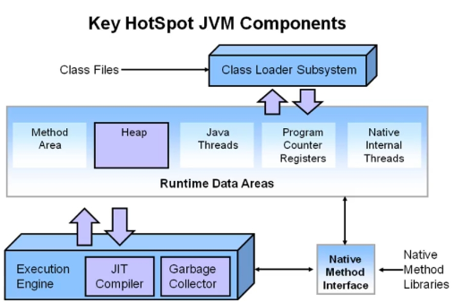
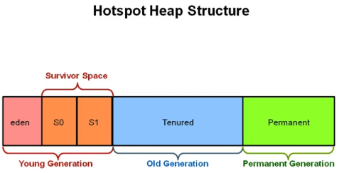
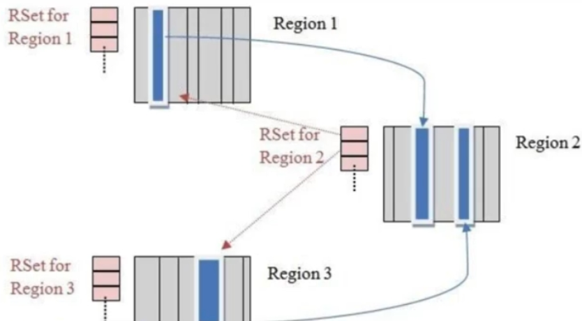

# G1   Garbage First Collector

吞吐量

- 吞吐量关注的是，在一个指定时间内看最大化一个应用的工作量
- 如下方式来衡量一个系统吞吐量的好坏：
  - 在一个小时内同一个事务（或者任务、请求）完成的次数（tps）
  - 数据库一小时可以完成多少次查询
- 对于关注吞吐量的系统，卡顿是可以接受的，因为这个系统关注长时间的大量任务的执行能力，单次快速的响应并不值得考虑。

响应能力

- 响应能力指一个程序或者系统对请求是否能够及时响应，比如：
  - 一个桌面UI能多快地响应一个事件
  - 一个网站能够多快返回一个页面请求
  - 数据库能够多快返回查询的数据
- 对于这类对响应能力敏感的场景，长时间的停顿是无法接受的。

## G1 Garbage Collect

- g1收集器是一个面向服务端的垃圾收集器，适用于多核处理器、大内存容量的服务端系统。
- 它满足短时间gc停顿的同时达到一个较高的吞吐量
- jdk7以上版本使用

### g1收集器的设计目标

- 与应用线程同时工作，几乎不需要stop the world(与cms类似)
- 整理剩余空间，不产生内存碎片（cms只能在full gc时，用stop the world整理内存碎片）
- gc停顿更加可控
- 不牺牲系统的吞吐量
- gc不要求额外的内存空间（cms需要预留空间存储浮动垃圾）
- g1的设计规划时要替换掉CMS
  - g1在某些方面弥补了cms的不足，比如：cms使用的是mark-sweep算法，自然会产生内存碎片；然而g1基于copying算法，高效的整理剩余内存，而不需要管理内存碎片
  - 另外，g1提供了更多手段，以达到对gc停顿时间可控

HotSpot虚拟机主要构成  

传统垃圾收集器堆结构

### G1收集器堆结构

- heap被划分为一个个相等的不连续的内存区域（regions）,每个regions都有一个分代的角色：eden、sruvivor、old
- 对每个角色的数量并没有强制的限定，也就是说对每种分代内存的大小，可以动态变化
- G1最大的特点就是高效的执行回收，优先去执行那些大量对象可回收的区域（region）
- G1使用了gc停顿可预测的模型，来满足用户设定的gc停顿时间，根据用户设定的目标时间，G1会自动选择哪些region要清除，一次清除多少个region
- G1从多个region中复制存活的对象，然后集中放入一个region中，同时整理、清除内存（copying 收集算法）

### G1 VS CMS

- 对比使用mark-sweep的cms,g1使用的copying算法不会造成内存碎片
- 对比Parallel Scavenge(基于copying)、Parallel Old收集器（基于mark-compact-sweep）,Parallel会对整个区域做整理导致gc停顿会比较长，而g1只是特定地整理几个region
- g1并非一个实时的收集器，与parallel scavenge一样，对gc停顿时间的设置并不绝对生效，只是g1有较高的几率保证不超过设定gc停顿时间。与之前的gc收集器对比，g1会根据用户设定的gc停顿时间，智能评估哪几个region需要被回收可以满足用户的设定。

### G1重要概念

- 分区（region）:g1采取了不同的策略来解决并行、串行和cms收集器的碎片、暂停时间不可控等问题。g1将整个堆分成相同大小的分区（region）

  

- 每个分区都可能是年轻代也可能是老年代，但是在同一时刻只能属于某个代。年轻代、幸存区、老年代这些概念还存在，成为逻辑上的概念，这样方便复用之前分代框架的逻辑。

- 在物理上不需要连续，则带来了额外的好处-有的分区内垃圾对象特别多，有的分区内垃圾对象很少，g1会优先回收垃圾对象特别多的分区，这样可以花费较少的时间来回收这些分区的垃圾，这也就是g1名字的由来，即首先收集垃圾最多的分区。

- 依然是在新生代满了的时候，对整个新生代进行回收--整个新生代中的对象，要么被回收、要么晋升，至于新生代也采取分区机制的原因，则是因为这样跟老年代的策略统一，方便调整代的大小

- g1还是一种带压缩的收集器，在回收老年代的分区时，是将存活的对象从一个分区拷贝到另一个可用分区，这个拷贝的过程就实现了局部的压缩。

- 收集集合（CSet）:一组可被回收的分区的集合。在CSet中存活的数据会在GC过程中被移动到另一个可用分区，CSet中的分区可以来自eden空间、survivor空间、或者老年代

- 已记忆集合（RSet）:Rset记录了其它region中的对象引用本region中对象关系，属于points-into结构（谁引用了我的对象）。RSet的价值在于使得垃圾收集器不需要扫描整个堆找到谁引用了当前分区中的对象，只需要扫描RSet即可。

- Region1和Region3中的对象引用了Region2中的对象，因为Region2的Rset中记录了这两个引用。

  

- G1 GC是在points-out的card table之上再加了一层结构来构成points-into Rset:每个region会记录下到底哪些别的region有指向自己的指针，而这些指针分别是哪些card的范围内。

- 这个Rset其实是一个hash table,key是别的region的起始地址，value是一个集合，里面的元素是card table的index.举例来说，如果region A的RSet里有一项的key是region B,value里有index为1234的card,它的意思就是region B的一个card里有引用指向region A。所以对region A来说，该RSet记录的是point-into的关系：而card table仍然记录了points-out的关系

- Snapshot-At-The-Beginning(SATB):SATB是G1 GC在并发标记阶段使用的增量式的标记算法。
- 并发标记是并发多线程的，但并发线程在同一时刻只扫描一个分区