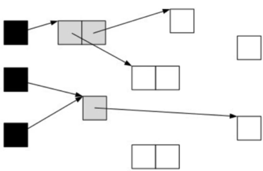
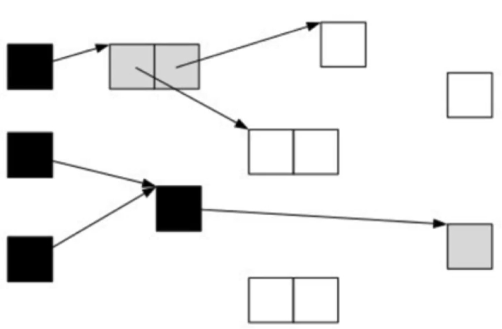
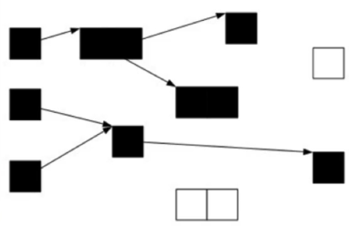
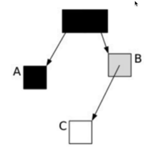
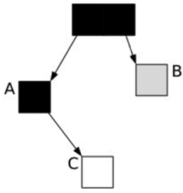
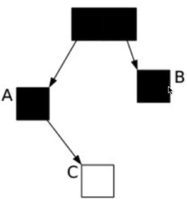

# G1   Garbage First Collector

## 三色标记算法

- 并发标记的三色算法-它是描述追踪式回收器的一种有效的方法，利用它可以推演回收器的正确性

- 将对象分成三种类型：

  - 黑色：根对象，或者改对象与它的子对象都被扫描过（对象被标记了，且它的所有field也被标记完了）
  - 灰色：对象本身被扫描，但还没扫描完该对象中的子对象（它的field还没有被标记或标记完）
  - 白色：未被扫描完，扫描完成所有对象之后，最终为白色的为不可达对象，即垃圾对象（对象没有被标记到）

- 根对象呗设置为黑色，子对象被置为灰色。

  

- 继续由灰色遍历，将已扫描了子对象的对象置为黑色

  

- 遍历了所有的可达的对象后，所有可达的对象都变成了黑色。不可达的对象即为白色，需要被清理。

  

- 但是如果在标记过程中，应用程序也在运行，那么对象的指针就有可能改变。这样的话，我们就会遇到一个问题：对象丢失的问题

- 当垃圾收集器扫描到下面的情况时：

  

- 这个时候应用程序执行了以下操作：

  - A.c= c
  - B.c= null

- 这样，对象的状态图变成了如下情形：

  

- 这时候垃圾收集器在标记扫描的时候就会变成下图这样

  

- 很显然，此时C是白色，被认为是垃圾需要清理掉，显然这是不合理的

## SATB

- 在G1中，使用的STAB（Snapshot-At-The-Beginning）的方式，删除的时候记录所有的对象
- 它有三个步骤
  - 在开始标记的时候生成一个快照图，标记存活的对象
  - 在并发标记的时候所有被改动的对象入队（在write barrier里吧所有旧的引用所指向的对象都变成非白的）
  - 可能存在浮动垃圾，将在下次被收集
- G1到现在可以知道哪些老的分区可以回收垃圾最多。当全局并发标记完成后，在某个时刻，就开始了Mixed GC.这些垃圾回收被称作“混合式”是因为它们不仅仅进行正常的新生代垃圾收集，同时也回收部分后台扫描线程标记的分区
- 混合式GC也是采用的复制清理策略，当GC完成后，会从新释放空间
- 为老年代设置分区的目的是老年代里有的分区垃圾多，有的分区垃圾少，这样在回收的时候可以专注于收集垃圾妒忌的分区，这也是G1名称的由来。
- 不过这个算法并不适合新生代垃圾收集，因为新生代的垃圾收集算法是复制算法，但是新生代也使用了分区机制主要是因为便于代大小的调整

## SATB详解

- SATB是维持并发GC的一种手段。G1并发的基础就是SATB.SATB可以理解成在GC开始之前对堆内存的对象做一个快照，此时活的对象就认为是活的，从而形成一个对象图。
- 在GC收集的时候，新生代的对象也认为是活的对象，除此之外其它不可达的对象都认为是垃圾对象
- 如何找到在GC过程中分配的对象呢？每个region记录着两个top-at-mark-start(TAMS)指针，分别为prevTAMS和nextTAMS.在TAMS以上的对象就是新分配的，因而被视为隐式的marked.
- 通过这种方式我们就找到了在GC过程中新分配的对象，并把这些对象认为是活的对象
- 对于GC过程呢中引用发生变化的问题，G1给出的解决办法是通过Write Barrier.Write Barrier就是对引用字段进行赋值做了额外处理。通过Write Barrier就可以了解到哪些引用对象发生了什么样的变化
- mark的过程就是遍历heap标记live object的过程，采用的是三色标记算法，这三种颜色为white（表示还未被访问到）、grap(访问到但是它用到的引用还没有完全扫描)、black(访问到而且启用到的引用已经完全扫描完)
- 整个三色标记算法就是从GC roots出发遍历heap,针对可达对象先标记white为gray,然后再标记gray为black;遍历完成之后所有可达对象都是black的，所有white都是可以回收的
- SATB仅仅对于在marking开始阶段进行 snapshot(marked all reacheable mark start),但是cocurrent的时候并发修改可能造成对象遗漏标记
- 对black新引用一个white对象，然后又从gray对象中删除了该white对象的引用，这样会造成该white对象漏标记
- 对black新引用一个white对象，然后从gray对象删了一个引用该white对象的white对象，这样也会造成了该white对象漏标记
- 对black新引用了一个刚new出来的white对象，没有其它gray对象引用该white对象，这样也会造成了该white对象漏标记
- 对于三色算法在concurrent的时候可能产生的漏标记的问题，SATB在marking阶段中，对于从gray对象移除的目标引用对象标记为gray,对于black引用的新产生的对象标记为black;由于是在开始的时候进行snapshot，而可能存在Floating Garbage
- 漏标与误标
  - 漏标没关系，顶多造成浮动垃圾，在下次gc中可以回收，但是误标的后果是致命的，把本该存活的对象给回收了，从而影响程序的正确性
  - 漏标的情况只会发生在白色对象中，且满足以下任一一个条件：
    - 并发标记时，应用线程给一个黑色对象的引用类型字段赋值了该白色对象
      - 此情况，利用post-write barrier,记录所有新增的引用关系，然后根据这些引用关系为根从新扫描一遍
    - 并发标记时，应用程序删除所有灰色对象到该白色对象的引用
      - 此情况，利用pre-write barrier,将所有即将被删除的引用关系的旧引用记录下来，最后以这些旧引用为根从新扫描一遍

### 停顿预测模型

- G1收集器突出表现出来的一点是通过一个停顿预测模型根据用户配置的停顿时间来选择CSet的大小，从而达到用户期待的应用程序暂停时间。
- 通过-XX:MaxGCPauseMillis参数来设置。这一点有点类似于ParallelScavenge收集器。关于停顿时间的设置并不是越短越好。
- 设置的时间越短意味着每次收集的CSet越小，导致垃圾逐步积累变多，最终不得不退化成Serial GC;停顿时间设置太长，那么会导致每次都会产生长时间的停顿，影响了程序以外的响应时间

### G1的收集模式

- Yong GC:收集年轻代里的Region
- Mixed GC:年轻代的所有Region + 全局并发标记阶段选出的收益高的Region
- 无论是Yong GC还是Mixed GC都只是并发拷贝的阶段
- 分代G1模式下选择CSet有两种子模式，分别对应Yong GC和Mixed GC:
  - Yong GC:CSet就是所有年轻代理面的Region
  - Mixed GC:CSet 是所有年轻代里的Region加上在全局并发标记阶段标记出来的收益高的Region
- G1的运行过程是这样的：会在Yong GC和Mixed Gc之间不断地切换运行，同时定期地做全局并发标记，在实在赶不上对象创建速度的情况下使用Full GC(Serial GC)
- 初始标记是在Yong GC上执行的，在进行全局并发标记的时候不会做Mixed  GC,在做Mixed GC的时候也不会启动初始化标记阶段
- 当Mixed GC赶不上对象产生的速度的时候就退化成Full GC,这一点是需要重点调优的地方

### G1最佳实践

- 不断调优暂停时间指标
  - 通过-XX:MaxGcPauseMillis=x可以设置启动应用程序暂停的时间，G1在运行的时候回根据这个参数选择CSet来满足响应时间的设置。一般情况下这个值设置到100ms或者200ms都是可以的（不同情况下会不一样），但是如果设置成50ms就不太合理。暂停时间设置的太短，就会导致出现G1跟不上垃圾产生的速度。最终退化成Full GC.所以对这个参数的调优是一个持续的过程，逐步调整到最佳状态。
- 不要设置新生代和老年代的大小
  - G1收集器在运行的时候会调整新生代和老年代的大小。通过改变代的大小来调整对象晋升的速度以及晋升的年龄，从而达到我们为收集器设置的暂停时间目标。
  - 设置了新生代大小相当于放弃了G1为我们做的自动调优。我们需要做的是只是调整整个堆内存的大小，剩下的交给G1自己去分配各个代的大小即可。
- 关注Evacuation Failure
  - Evacuation Failtrue类似于CMS里面的晋升失败，堆空间的垃圾太多导致无法完成Region之间的拷贝，于是不得不能不退化成Full GC来做一次全局范围内的垃圾收集