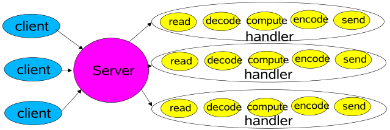
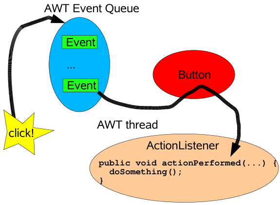

# java可扩展IO

## 大纲

- 可扩展网络服务
- 事件驱动处理
- Reactor 模型
  - 基本版
  - 多线程版
  - 其它变体
- java.nio非阻塞IO API演练

## 网络服务

- web服务，分布式对象等，大多数具有相同的基本结构：
  - 读请求
  - 解码请求
  - 流程处理服务
  - 编码回复
  - 发送回复
- 但是每个步骤的性质和成本不同(对系统资源的使用不同)
  - xm解析
  - 文件传输
  - web页面生成
  - 计算服务 ....

## 经典服务设置



每个处理程序可以在其自己的线程中启动

## 经典ServerSocket循环

```java
class Server implements Runnable {
    public void run() {
    try {
        ServerSocket ss = new ServerSocket(PORT);
        while (!Thread.interrupted())
        new Thread(new Handler(ss.accept())).start();
        // or, single-threaded, or a thread pool
    } catch (IOException ex) { /* ... */ }
}
static class Handler implements Runnable {
	final Socket socket;
	Handler(Socket s) { socket = s; }
	public void run() {
    try {
        byte[] input = new byte[MAX_INPUT];
        socket.getInputStream().read(input);
        byte[] output = process(input);
        socket.getOutputStream().write(output);
    } catch (IOException ex) { /* ... */ }
    }
    private byte[] process(byte[] cmd) { /* ... */ }
    }
}
```


注意: 大多数异常处理都来自代码示例

## 可扩展性目标

- 负载增加时的平稳降级（更多客户端）
- 通过增加资源（CPU，内存，磁盘，带宽）进行持续改进
- 同时满足可用性和性能目标
  - 短延迟
  - 满足高峰需求
  - 可调整的服务质量
- 分而治之通常是实现任何可扩展性目标的最佳方法

## 分而治之

- 将处理分为小任务

  每个任务执行一个动作而不会阻塞

- 启用每个任务后执行

  此处，IO事件通常充当触发器

  

- java.nio支持的基本机制
  - 非阻塞读写
  - （与感测到的IO事件相关的调度任务） 通过IO事件的监测，来触发相应的调度任务
- 无限变体（一系列的事件驱动设计，可能会产生很多的变体）
  - 事件驱动设计系列

## 事件驱动设计

- 通常比替代方法更有效

  - 较少的资源
    - 不要为每一个客户端创建一个线程
  - 低开销
    - 少的加锁操作，来达到少的上下文切换(少的上下文切换通常伴随着少的加锁操作)

  - 但是调度可能会更慢
    - 必须手动的为每个事件绑定动作

- 通常较难编程

  - 必须分解为简单的非阻塞动作
    - 类似于GUI事件驱动的操作
    - 无法消除所有阻塞：GC，页面错误等
  - 必须跟踪逻辑服务状态

## 背景：AWT中的事件



在不同的设计中，事件驱动使用类似的思想

## Reactor 模式

- Reactor通过调度适当的处理程序来响应IO事件

  - 类似于AWT线程

- 处理程序的执行是非阻塞的

  - 类似于AWT ActionListeners

- 通过将处理程序绑定到事件进行管理

  - 类似于AWT actionListener

- 参见Schmidt等人的“面向模式的软件体系结构，第2卷（POSA2）”

  还有Richard Stevens的网络书籍，Matt Welsh的SEDA框架等。

### 基本Reactor 设计


单线程版本

### java.nio 支持

- Channels

  与支持无阻塞读取的文件，套接字等的连接

- Buffers 

  通道可以直接读取或写入的类数组对象

- Selectors 

  判断一组通道中的哪些发生IO事件

- SelectionKeys 

  维护IO事件状态和绑定

### Reactor 1: 启动

```java
class Reactor implements Runnable {
final Selector selector;
final ServerSocketChannel serverSocket;
Reactor(int port) throws IOException {
selector = Selector.open();
serverSocket = ServerSocketChannel.open();
serverSocket.socket().bind(
new InetSocketAddress(port));
serverSocket.configureBlocking(false);
SelectionKey sk =
serverSocket.register(selector,
SelectionKey.OP_ACCEPT);
sk.attach(new Acceptor());
}
/*
或者使用显式的spi提供程序
Alternatively, use explicit SPI provider:
SelectorProvider p = SelectorProvider.provider();
selector = p.openSelector();
serverSocket = p.openServerSocketChannel();
*/
```


