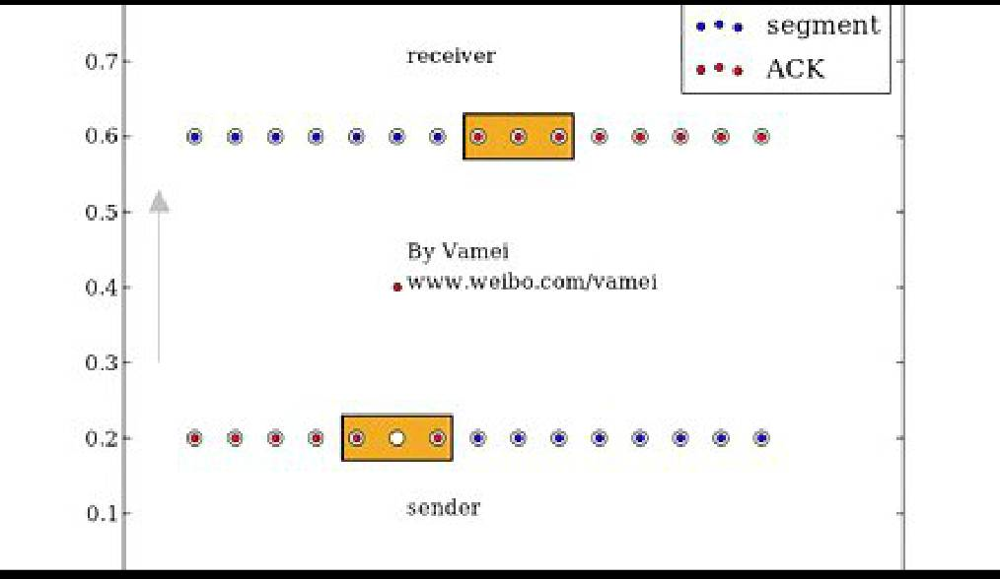

传输层协议：tcp udp

tcp协议复杂，但是传输可靠

udp协议简单，但是传输不可靠

## udp协议

Udp（user datagram protocol）（ best effort）协议是不可靠传输，在ip的基础上增加了端口。通过端口使不同的进程进行通信

Udp协议晚于tcp协议。早期的数据传输都是基于tcp协议。ip协议功能和tcp协议功能相对独立，对于有些简单通信，best effort方式即可，tcp连接过多，网络负担重，udp相对简单，可快速处理简单通信。udp可看作ip协议在传输层的傀儡

udp协议异常简单，实际上只是起到了一个桥梁的作用

### udp协议头部

source port 发出端口

destination port 目的端口

length整个udp包的长度

checksum 和ip协议的head cheksum算法类似。不同的是，udp的checksum所校验的序列包括了整个udp的数据包，及封装ip头部的一些信息（主要是发出ip和目的ip）,这样可以对ip端口的正确性进行校验。ipv4中checksum可以为0，可不使用checksum ,ipv6中必须使用checksum

### 端口与socket

tcp和udp本质上都是一个端口到另外一个端口的通信。端口使得ip层的数据包进行了区分（各自通信通道进行数据交互）

​		socket是操作系统提供的一个编程接口，用来代表某个网络通信。应用程序通过socket来调用系统内核中处理网络协议的模块，而这些模版会负责具体的网络协议的实施。屏蔽了底层协议实现细节（底层协议的包如何组装），应用程序只用关心 例如 ip地址 端口 传输信息

## tcp协议与流通信

Tcp(transportation control protocol)，事实上ip协议和tcp协议早期是同一个东西，后来被拆分为网络层和传输层。udp是ip协议在传输层的傀儡，实现数据包形式的通信，tcp实现流 形式的通信

### 流通信

ip协议和upd协议采用的是数据包的方式传送，后发出的数据可能早到，不能保证数据到达顺序。tcp协议确保数据到达的顺序与文本流顺序相符。计算机从tcp协议接口读取数据时，数据已是排列好顺序的流了。

tcp流边接受边记录，接受完后数据有序。udp有序必须全部接收完然后排序，才能有序记录下来-接收端压力比较大，当接收大文件时。

流的要点是次序，tcp也是基于ip协议的数据包传输的，超过mtu的数据包也会拆分。所以，tcp协议封装的ip包不是整个文本流，，而是tcp协议所规定的片段（segment），tcp片段同样分头部(head)、数据（payload）（片段更多的作用是提示这不是完成的文本流）。整个文本流按顺序被分成小段，每一段被放入tcp片段的数据部分。tcp片段不超过ip接力路径上的最小mtu,避免碎片化问题（framentation），减少网络负担

文本流分段是在发送主机完成的，

### 可靠性

ip协议是不可靠的（best effort）,数据可能乱序

tcp补救的方法是，在每收到一个正确的、符合次序的片段后，就向发送方发送一个特殊的tcp片段（ACK回复），用来知会（ack,acknoledge）发送方：我已经收到呢个片段了。如果片段序列号为L,对应ack回复号是L+1,也就是接收方期待接收的下一个片段的序号

发送方等待一段时间后没有接收到ack回复，会重复发送（retransmit）之前发送的呢个片段（被判断为异常片段），直到收到对应片段的ack回复（L+1的ack）

发送方接收到L+1ack，推断出之前发送片段已正常接收，随后发送L+1片段。ack回复也可能丢失，发送方重复发送，接收方接收已经知会过的片段，推断ack回复丢失，重复发送ack回复。通过以上机制，使传输变的可靠。tcp是一种不断尝试，最终成功

### 滑窗

​		发送-》等待ack->发送->等待ack 的工作方式叫stop-and-wait，虽实现了tcp通信可靠，但是牺牲了网络通信效率。

​		等待ack时间内，网络处于闲置（idle）状态。如果有一种方式，可同时发送多个片段，由于ip包传输无次序，可能乱序（out-of-order),我们可以在缓存中存放先存放乱序片段，等其它片段补充完毕，再将先到的片段缀在后面。 如果片段太乱，则会占用太久缓存。这种做法是：缓存一些不呢么乱的片段，期望在一段时间内补充上之前的片段（暂不处理，但发送对应的ack）;对于乱的比较厉害的片段，则将他们拒绝（不处理，也不发送对应的ack）

滑窗（sliding window）被同时应用于发送方和接收方，用于解决以上问题。当片段处于滑窗中，标识tcp正在处理该片段，滑窗中有多个片段，表示可以同时处理多个片段。滑窗越大，处理的片段，则就越多，当然滑窗占用的缓存就越多

​		假设可以容纳三个片段的滑窗，片段从左向右排列。对于发送发，滑窗的左侧为已发送并ACK过的片段序列，滑窗右侧为未发送的片段。滑窗中的片段（比如5 6 7 片段）被发送出去，收到片段5的ack后，滑窗向右移动，这样新的片段从右侧进入滑窗，被发送出去，并进入等待状态。在接收到片段5的ack之前，滑窗不会移动，即便已接收 6 7的ack.这样，就保证滑窗左侧的序列是已经发送的、接收到ack的、符合顺序的片段序列

​		接收方，滑窗的左侧是已经正确收到并ack回复过的片段（比如片段 1 2 3 4 ），也就是正确接收到的文本流。滑窗中期望接收的片段（5 6 7）。同样，如果6 7 先到达，滑窗也不会移动。如果片段5先到达，那么滑窗会向右移动，以等待接收新的片段。如果出现滑窗之外的片段，比如片段9，呢么滑窗将会拒绝接收

​	sliding window

