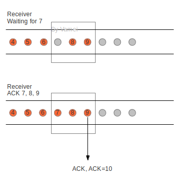
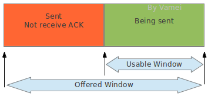
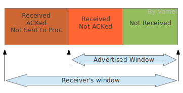

### 累计ACK

​	在tcp连接中，将ack回复附着在其他数据片段的方式，减少了ack回复所消耗的流量。

tcp并不是对每个片段都进行ack回复，实际是累计ack回复，接收方利用一个ack回复来知会连续多个片段的成功接收。降低交互次数

​	如图所示，橙色为已经接收的片段，方框为滑窗，滑窗可容纳3个片段

​	滑窗还没有接收到片段7时，已接收到片段8 9，在滑窗中制造一个空穴（hole）。当接收到7后，滑窗发送一个回复号为10的ack。发送方接收到改ack后，知道10之前的片段已全部接收。整个过程节约了8 ,9片段ack的回复。

​	接收方接收到片段后，应该回复ack，会故意拖延一会，在拖延时间内有别的片段到来，就可以使用累计ack进行回复

## 滑窗结构

​		滑窗以byte为单位表示大小。

​		发送方滑窗可以分为两部分。offered window 为整个滑窗大小

接收方滑窗可分为三个部分

接收方比发送方多了一个 Received;ACKed;Not Sent to Proc 部分。接收方接收到文本流后必须等待进程来读取。如果进程忙于别的事，正确接收的文本需要暂时占用接收缓存。这种情况下，滑窗的可用部分（advertise window）就会缩水，接收方将无力接收这些数据。

## 流量控制

​	tcp协议会根据流量情况自动改变滑窗大小，实现流量控制。流量控制（flow control）是指接收方将advertised         

 window的大小通知给发送方，指导发送方调整offered window的大小。接收方将该信息放到tcp头部的window size区域

 发送方接收到window size通知，调整自己滑窗的大小，让offered window和advertised widow相符。这样，发送窗口变小，文本流发送率降低，从而减少了接收方的负担。

## 零窗口

​		advertised window大小可能变为0，意味着接收方不能接收。发送方接收到通知后，停止发送。

接收方经过处理，产生可用advertised window,会通过纯粹ack回复通知发送方恢复发送。如果ack回复丢失，tcp传输将陷入死锁状态。所以，发送方在零窗口后，会不断的探测接收方的窗口。窗口探测（window probe）时，发送方发送包含1byte文本流tcp片段，并等待含有windowd size的ack回复。由于有1byte的数据存在，所以传输时可靠的，不用担心ack丢失问题。如果探测结果依然为0，则发送方会等待更长时间之后才会再次探测，直到tcp传输恢复。

## 白痴窗口综合症（Silly Window Syndrome）

​	接收方宣布（a dvertise）一个小的窗口，发送方根据advertised window,发送一个小的片段。接收方被填满，之后再宣布一个小的窗口，造成的情况时：tcp通信片段中包含的数据量很小，流量主要是tcp片段的头部，造成流量浪费（实际情况我们希望每个tcp片段中含有比较多的数据）

​	如果发送方不断发送小的片段，也会造成上面的情况。为此tcp中规定：

​	1接收方宣告的窗口必须达到一定的尺寸，否则等待

​	2除了一些特殊情况（最小化延迟的tcp应用，例如命令行互动），发送方发送的片段必须达到一定的尺寸，否则等待。

