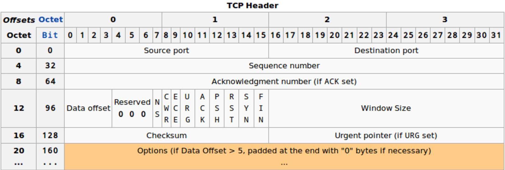

tcp协议是一个可靠的协议，它通过从新发送(retransmission)来实现可靠性。tcp不断重复发送tcp片段，直到片被正确接收。

## tcp片段丢失

tcp首部格式

接收方通过校验tcp投不中的checksum区域来检验tcp片段是否出错。ip协议的checksum只校验头部，tcp协议的checksum会校验ip头部，tcp头部，tcp数据在内的整个序列，确保ip地址，端口号和其他相关信息正确。如果tcp片段出错，接收方可以简单的丢弃该tcp片段。

​	tcp片段包裹在一个ip包中。ip包丢失的原因可能有很多种。例如：ip包经过太多的路由器，达到hop limit；路由器太过拥挤，导致ip包被丢弃；路由表（routing table）没有及时更新，导致ip包无法送达目的地。

​	tcp重发机制：超时重发和快速重发

## 超时重发

 	发送方发送一个tcp片段后，开始计时，计时完成后还没有接收到接收方回复的ack,则认为发送数据丢失，进行从新发送。这个等待时间叫 从新发送超时时间（rto ,retransmission timeout）

​	超时时间？

​	发送实际涉及两个过程：

​	1发送方发出

​	2接收方回复

整个过程消耗的时间叫往返时间（rtt,round trip time）.如果rtt固定，我们可以让rto等待rtt

实际是rtt上下浮动很大。例如：某刻网络堵塞，那么rtt就增加。如果rto设置过小，那么tcp等待很短时间就会从新发送，实际上之前发送的片段并没有丢失，只是传输的比较慢而已，这样网络中被注入重复的tcp片段，浪费网络资源。

如果rto时间过长，tcp丢失，发送方不能及时重发，造成网络资源闲置。所以rto应该适应网络，网络越好 rto越短，网络越差，rto越长

​																					RTT:往返时间

tcp协议通过统计rtt,来决定合理的rto.发送方可以测量每一次的srtt,叫做采样rtt（srtt,sampling round trip time）.建立连接后，每次的srtt作为采样样本，计算平均值（mean）和标准差（standard deviation）,并让rto等于srtt平均加上四倍的srtt标准差，即：rto=mean+4srtt.(算法有多个变种，视平台而定)

平均值反应平均意义上的rtt,平均往返时间越大，rto越大。另一方面，标准差越大也会影响rto.标准差代表来rtt样本的离散程度。如果rtt上下剧烈浮动，标准差比较大。rtt浮动大说明当前网络状况相对不稳定，因此要设置更长的rto,以应对不稳定的网络状况

## 快速从新发送

发送方在超时之前，从新发送叫快速从新发送（fast-retransmission).快速从新发送打断计时器的等待，直接从新发送tcp片段

ip包无序，导致后发的片段可能先接收到，也就是乱序（out-of-order）。乱序片段不等于最近发送的ack回复号，接收方接收到5，6，7，9将出现空洞（hole）为片段8准备的空位。tcp协议规定，当收到乱序时，需要重复发送ack.这里需要重复发送回复号8，后续接收方接收到的片段还不是8，则接着回复8.当发送方接收饿到3个ack=8之后，即便此刻没有超时，会打断计时，直接从新发送片段8，这就是快速从新发送机制。

​	此机制利用重复ack来提示空洞的存在，当重复达到阈值时，认为空洞对应的片段在网络中丢失，提高了检测丢失片段的效率，往往可以在超时之前进行重复发送。

