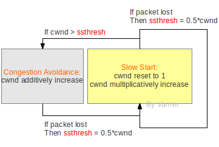

## 网络堵塞

udp是不可靠传输，在网络堵塞的时候，可随意丢弃。

tcp是可靠传输，在网络堵塞遭到片段丢弃的时候，会不停的进行重发。从而导致网络更为堵塞，再丢再发，直到网路崩溃,造成大量网络传输资源浪费。此情况叫网络堵塞崩溃（congestion collapse）

八十年代tcp加入网络堵塞控制（congestion control）

tcp协议通过约束自己来实现网络堵塞控制。发送方探测到网络堵塞，会控制发出片段的速率，以缓解堵塞情况。

如何确定网络堵塞：发送超时和接收到重复ack 则认为网络堵塞。

## tcp如何控制发送速率

tcp协议通过控制滑窗（sliding window)大小来控制发送率。advertised window size实现tcp流量控制。tcp还会维护一个congestion window size,以根据网络状况来调整滑窗大小.真实滑窗取这两个滑窗里的最小值，从而同时满足两个限制（流量控制和堵塞控制）

## congestion window

Congestion window 总是处于两种状态的一个。慢启动（slow start）和堵塞避免（congestion avoidance）

上图是概念图。实际的实施要不上图复杂，而且根据算法的不同会有不同的版本。cwnd代表congestion window size .我们以片段的个数为单位，来表示cwnd的大小（同样是概念性的）

​	congestion window从slow start的状态开始。slow start的特点是初始化速率低，但速率不断倍增。每次进入到slow start状态时，cwnd都需要重置为初始值1.发送方每接收到一个正确的ack,就会将congestion window增加1，从而实现速率的倍增（由于累计ack,速率增长可能会小于倍增）。

​		当congestion window的大小达到某个阈值ssthresh时，congestion进入到congestion avoidance状态。发送速率会继续增长。发送方在每个窗户所有片段成功传输后，将窗口尺寸增加1（实际上时每个rtt增加1）。所以在congestion avoidance下，cwnd线性增长，增长速率慢，。

​		如果congestion avoidanvce下有片段丢失，从新回到slow start状态，并将ssthresh更新为cwnd的一半。

​		我们看到，ssthresh时slow start到congestion avoidance的切换点。而片段丢失是congestion avoidance到slow start的切换点。一开始sshthresh的值一般比较大，所以slow start可能在切换成congestion avoidance之前就丢失片段。这种情况下，slow start会从新开始，而ssthresh更新为cwnd的一半

​		总的说来，发送速率总是在增长。如果片段丢失，则重置速率为1，并快速增长。增长到一定程度，则进入到慢性增长。快速增长和慢性增长的切换点（ssthresh）会随着网络状况（何时出现片段）更新。通过上面的机制，让发送速率处于动态平衡，不断尝试更大的值。初始时增长快，而接近饱和时增长快。但一旦尝试过度，则迅速重置，以免造成网络负担