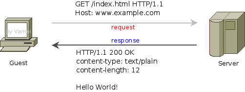

人们习惯以文件为单位传输资源，比如文本文件，图像文件，超文本文档（hypertext document）.

超文本文档中含有超链接，指向其它资源。超文本文档是万维网的基础。

http协议解决的是文件传输问题。http是应用层协议，主要建立在tcp之上，偶尔也可以udp。随着万维网的流行，http协议目的是，如何在万维网的网络环境下，更好的利用tcp协议，以实现文件，特别是超文本文件的传输。

早期http主要传输的是静态文件，即存储在服务器上的文件。随着万维网的发展，http协议用于传输 动态文件，服务器上的程序更具http请求时即时生成动态文件。我们将http的传输对象统称为资源。

http实现资源的订购和传送。

1请求 request

2回复 response

## 格式

http协议的通信是一次request-response的交流。客户端（guest）向服务器发出请求（request）,服务器（server）回复（response）客户端



http协议规定了请求和回复格式

```http
起始行(start line)
头信息（headers）

主体（entry body）
```

起始行只有一行。它包含请求/回复最重要的消息。请求的起始行表示 想要什么。回复的起始行表示 发生了什么。

头信息可以有多行。每一行是一对键值对（key-value pair）,比如：

```http
Content-type:text/plain
```

它表示，包含一个名为Content-type的参数，该参数的值为texp/plain.头信息是对起始行的补充。请求的头信息对服务器有指导意义。回复的头信息则是提示客户端。

主体部分包含了具体的资源。主体可以有也可以没有。

## 请求

```http
GET /index.html HTTP/1.1
Host www.example.com
```

在起始行中，有三段信息：

GET:用于说明想要服务器执行的操作，此外还有PUT POST操作

/index.html:资源的路径。这里指向服务器服务器上的index.html文件。

HTTP/1.1:协议的版本。http第一个广泛使用的版本是1.0，当前版本为1.1

早期http只有get方法。get向服务器索取资源，所以往往没有请求主体。get用于传输一些不重要的数据，以改写url的方式实行。在url后加请求地址?key=value。服务器收到请求后就可以知道key对应的值。

get之外，最常用的是post方法。用户客户端向服务器提交数据。使用post方法，url不在改写。数据位于http请求主体。post常用于提交html的form数据。

样例中有一行头信息host。http请求必须要有头信息，用于说明请求的服务器地址和端口号。http协议默认的端口号是80，如果host中没有指定端口，则使用的是默认端口。域名将通过dns服务器转换为ip地址，确定服务器在互联网中的地址。

## 回复

服务器收到请求后，生成该请求的回复，比如：

```http
HTTP/1.1 200 OK
Content-type text/plain    
Content-length 12

hello world!
```

回复的起始行同样包含三段信息

```http
HTTP/1.1 协议版本
200 状态吗（ststus code）
OK 状态描述
```

ok是对状态码200的描述，便于人类阅读。电脑只关心三位的状态码（status code）,即这里的200.200表示一切ok,资源正常返回，状态码代表了服务器回应动作的类型。

其它常见的状态码还有：

302:重定向（redirect）,表示我这里没有你要的资源，但我知道另外一个地方***有，你可以去呢里找

404:无法找到（not found）,找不到对应资源

Content-type说明主体包含的资源类型。根据类型的不同，客户端启用不同的处理。

```http
text/plain 普通文本
text/html HTML文本
image/jpeg jpeg图片
image/gif gif图片
```

Content-length 说明了主体部分的长度，以字节（byte）为单位。

回应的主体部分是一段普通文本，即hello world!

## 无状态

早期http协议，每次request-response时，都要从新建立tcp连接。tcp每次都要从新建立，所以服务器无法知道上次请求和本次请求是否来自同一个客户端。因此，http通信时无状态的（stateless）.服务器认为每次请求都是一个全新的请求，无论该请求是否来自同一个地址。随着发展，http允许tcp连接复用，以节省建立连接所耗费的时间。但http协议依然无法保持 无（有）状态的特性。

可查看书籍《http权威指南》


