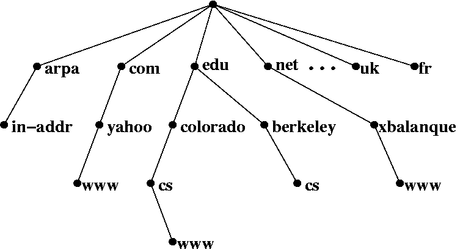
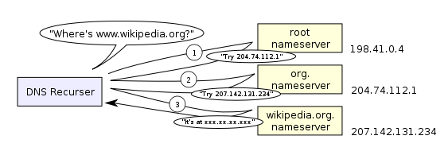
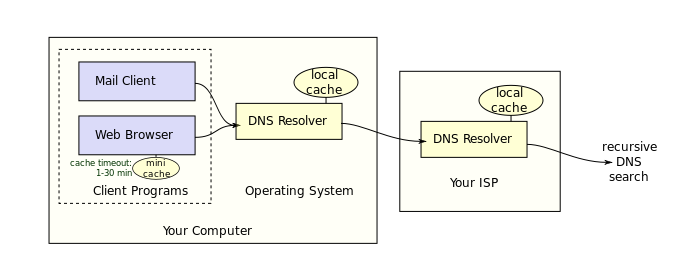

## dns服务器

域名和ip地址的对应关系存储在dns服务器中。dns服务器是进行域名解析的服务器，这些服务器都有自己的ip，使用dns协议（dns protocol）进行通信.dns协议主要基于udp,是应用层协议

域名是树状存储结构。

按层级进行查找

## 缓存

域名解析模板（dns resolver）负责域名解析的相关工作。dns resolver有dns缓存（cache）,用来记录最近使用和查询的域名/ip关系。每次域名解析先查询缓存，查不到在进行递归查询过程

## 反向dns

上面的是根据域名查ip，如果根据ip查域名，则称为反向dns.反向dns也采用分层查询方式，对于一个ip地址（例如；106.10.170.118），依此查询in-addr.arpa节点（ipv6,则为ip6.arpa）,106节点，10节点，170节点，并在该节点获得106.10.170.118对应的域名。

## 实例

视频讲解

http://v.youku.com/v_show/id_XNTAwNDY2NjYw.html

